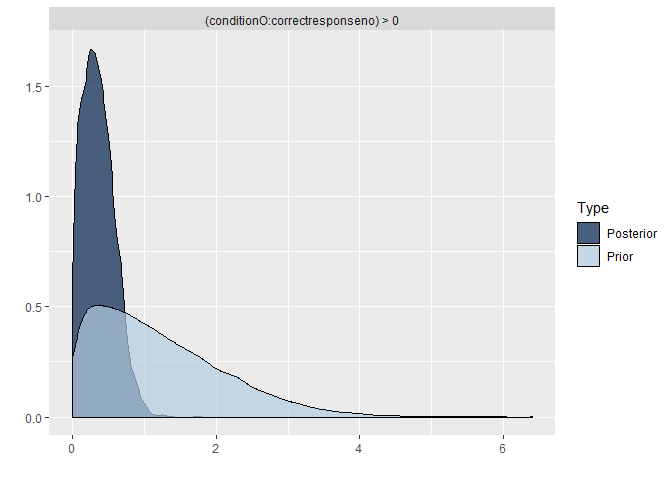
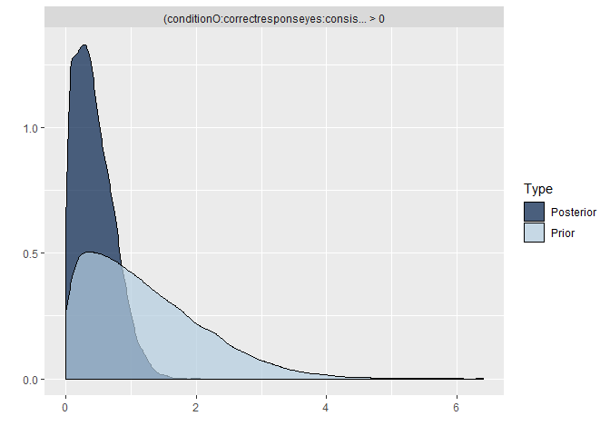
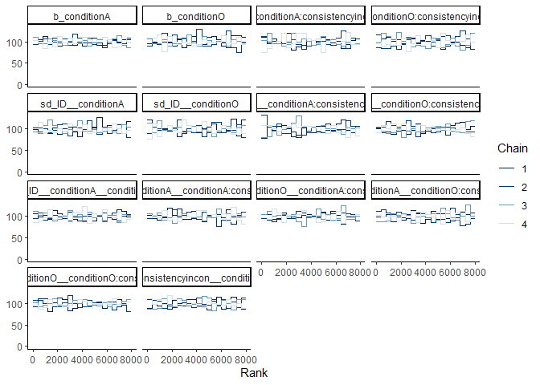
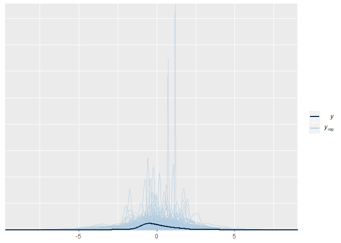
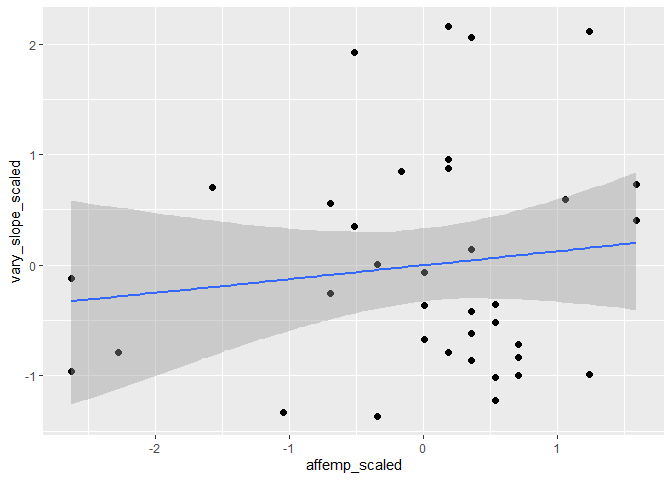

### Packages + Functions

### Exploring Data

``` r
setwd("C:/Users/louis/OneDrive - Aarhus universitet/AU Onedrive - RIGTIG/- 4. Semester/Social and Cultural Dynamics in Cognition/Exam related/Coding/data")

# Reading data
d <- read.csv("FINAL_DATA.csv")

# turn ID into factor
d$ID <- as.factor(d$ID)

# check if any NA's
d[!complete.cases(d), ]
```

    ##  [1] ID              gender          age             native         
    ##  [5] siblings        cogemp          affemp          totalemp       
    ##  [9] block           stimuli         condition       direction      
    ## [13] self            other           consistency     cue            
    ## [17] correctresponse response        accuracy        RT             
    ## [21] participant    
    ## <0 rows> (or 0-length row.names)

``` r
# Adding log RTs to the data frame
d$RT_log <- log(d$RT)
summary(d$RT_log)
```

    ##    Min. 1st Qu.  Median    Mean 3rd Qu.    Max. 
    ##   5.176   6.397   6.579   6.596   6.770   7.601

``` r
# Adding a column with the approximate ndt subtracted
d$RT_log_ndt <- log(d$RT - 200)
```

    ## Warning in log(d$RT - 200): NaNs produced

``` r
summary(d$RT_log_ndt)
```

    ##    Min. 1st Qu.  Median    Mean 3rd Qu.    Max.    NA's 
    ##   4.710   5.991   6.254   6.256   6.509   7.496       1

``` r
# Summary statistics
mean(d$RT_log)
```

    ## [1] 6.595524

``` r
sd(d$RT_log)
```

    ## [1] 0.2805272

``` r
# Adding scaled empathy measures
d$totalemp_scaled <- scale(d$totalemp)
d$cogemp_scaled <- scale(d$cogemp)
d$affemp_scaled <- scale(d$affemp)


# Subsetting into data sets
y <- subset(d, correctresponse == "yes" & (accuracy == "correct" | accuracy == "incorrect"))
# Yes-trials, excluding late responses: 3552 yes trials, removing 6 late trials = 3546
n <- subset(d, correctresponse == "no")
# No-trials (all responses)
c <- subset(d, accuracy == "correct")
# All trials, only correct responses
cy <- subset(c, correctresponse == "yes")
# Yes-trials, only correct responses
d_nolate <- subset(d, accuracy == "correct" | accuracy == "incorrect")


# Participant stats
test <- d %>% group_by(ID) %>% summarise (mean_age = mean(age))
mean(test$mean_age)
```

    ## [1] 32.16216

``` r
sd(test$mean_age)
```

    ## [1] 13.69005

``` r
min(test$mean_age)
```

    ## [1] 21

``` r
max(test$mean_age)
```

    ## [1] 57

### Preliminary Analysis

RT: Testing yes-no against each other - is there a difference?
--------------------------------------------------------------

``` r
# Model formula
RT_response <- bf(RT|trunc(ub = 2000) ~ 0 + condition : correctresponse + condition : consistency : correctresponse + (0 + condition : correctresponse + condition : consistency : correctresponse | ID))

# Defining priors
get_prior(RT_response, c, family = shifted_lognormal())
```

    ##                  prior class                                           coef
    ## 1                          b                                               
    ## 2                          b                   conditionA:correctresponseno
    ## 3                          b  conditionA:correctresponseno:consistencyincon
    ## 4                          b                  conditionA:correctresponseyes
    ## 5                          b conditionA:correctresponseyes:consistencyincon
    ## 6                          b                   conditionO:correctresponseno
    ## 7                          b  conditionO:correctresponseno:consistencyincon
    ## 8                          b                  conditionO:correctresponseyes
    ## 9                          b conditionO:correctresponseyes:consistencyincon
    ## 10              lkj(1)   cor                                               
    ## 11                       cor                                               
    ## 12   uniform(0, min_Y)   ndt                                               
    ## 13 student_t(3, 0, 10)    sd                                               
    ## 14                        sd                                               
    ## 15                        sd                   conditionA:correctresponseno
    ## 16                        sd  conditionA:correctresponseno:consistencyincon
    ## 17                        sd                  conditionA:correctresponseyes
    ## 18                        sd conditionA:correctresponseyes:consistencyincon
    ## 19                        sd                   conditionO:correctresponseno
    ## 20                        sd  conditionO:correctresponseno:consistencyincon
    ## 21                        sd                  conditionO:correctresponseyes
    ## 22                        sd conditionO:correctresponseyes:consistencyincon
    ## 23 student_t(3, 0, 10) sigma                                               
    ##    group resp dpar nlpar bound
    ## 1                             
    ## 2                             
    ## 3                             
    ## 4                             
    ## 5                             
    ## 6                             
    ## 7                             
    ## 8                             
    ## 9                             
    ## 10                            
    ## 11    ID                      
    ## 12                            
    ## 13                            
    ## 14    ID                      
    ## 15    ID                      
    ## 16    ID                      
    ## 17    ID                      
    ## 18    ID                      
    ## 19    ID                      
    ## 20    ID                      
    ## 21    ID                      
    ## 22    ID                      
    ## 23

``` r
RT_prior_response <- c(
  prior(normal(6.4, 0.2), class = b, coef = conditionA:correctresponseno),
  prior(normal(6.4, 0.2), class = b, coef = conditionA:correctresponseyes),
  prior(normal(6.4, 0.2), class = b, coef = conditionO:correctresponseno),
  prior(normal(6.4, 0.2), class = b, coef = conditionO:correctresponseyes),
  prior(normal(0, 0.2), class = b, coef = conditionA:correctresponseno:consistencyincon),
  prior(normal(0, 0.2), class = b, coef = conditionA:correctresponseyes:consistencyincon),
  prior(normal(0, 0.2), class = b, coef = conditionO:correctresponseno:consistencyincon),
  prior(normal(0, 0.2), class = b, coef = conditionO:correctresponseyes:consistencyincon),
  prior(normal(0, 0.2), class = sigma),
  prior(normal(0, 0.2), class = sd),
  prior(lkj(1), class = cor)
)

# Prior predictive check
RT_prior_response_m <- brm(
  RT_response,
  data = c,
  family = shifted_lognormal(),
  prior = RT_prior_response,
  sample_prior = "only",
  chains = 4,
  cores = 3,
  iter = 4000,
  seed = 28,
  control = list(
    adapt_delta = 0.95,
    max_treedepth = 20
  )
)
```

    ## Compiling the C++ model

    ## Start sampling

``` r
pp_check(RT_prior_response_m, nsamples = 1000)
```


``` r
# Model
RT_response_m <- brm(
  RT_response,
  data = c,
  family = shifted_lognormal(),
  prior = RT_prior_response,
  sample_prior = T,
  chains = 4,
  cores = 3,
  iter = 4000,
  seed = 28,
  control = list(
    adapt_delta = 0.95,
    max_treedepth = 20
  )
)
```

    ## Compiling the C++ model
    ## Start sampling

``` r
# Prior and posterior check together
pp_check(RT_prior_response_m, nsamples = 1000) + pp_check(RT_response_m, nsamples = 1000)
```


``` r
## Trace plots
mcmc_trace(RT_response_m, pars = vars(-contains("["), -contains("prior"), -contains("lp"))) + theme_classic()
```


``` r
mcmc_rank_overlay(RT_response_m, pars = vars(-contains("["), -contains("prior"), -contains("lp"))) + theme_classic()
```


``` r
# Quality check
summary(RT_response_m)
```

    ##  Family: shifted_lognormal 
    ##   Links: mu = identity; sigma = identity; ndt = identity 
    ## Formula: RT | trunc(ub = 2000) ~ 0 + condition:correctresponse + condition:consistency:correctresponse + (0 + condition:correctresponse + condition:consistency:correctresponse | ID) 
    ##    Data: c (Number of observations: 6753) 
    ## Samples: 4 chains, each with iter = 4000; warmup = 2000; thin = 1;
    ##          total post-warmup samples = 8000
    ## 
    ## Group-Level Effects: 
    ## ~ID (Number of levels: 37) 
    ##                                                                                                    Estimate
    ## sd(conditionA:correctresponseno)                                                                       0.15
    ## sd(conditionO:correctresponseno)                                                                       0.17
    ## sd(conditionA:correctresponseyes)                                                                      0.16
    ## sd(conditionO:correctresponseyes)                                                                      0.16
    ## sd(conditionA:correctresponseno:consistencyincon)                                                      0.04
    ## sd(conditionO:correctresponseno:consistencyincon)                                                      0.02
    ## sd(conditionA:correctresponseyes:consistencyincon)                                                     0.04
    ## sd(conditionO:correctresponseyes:consistencyincon)                                                     0.02
    ## cor(conditionA:correctresponseno,conditionO:correctresponseno)                                         0.94
    ## cor(conditionA:correctresponseno,conditionA:correctresponseyes)                                        0.80
    ## cor(conditionO:correctresponseno,conditionA:correctresponseyes)                                        0.83
    ## cor(conditionA:correctresponseno,conditionO:correctresponseyes)                                        0.80
    ## cor(conditionO:correctresponseno,conditionO:correctresponseyes)                                        0.81
    ## cor(conditionA:correctresponseyes,conditionO:correctresponseyes)                                       0.94
    ## cor(conditionA:correctresponseno,conditionA:correctresponseno:consistencyincon)                        0.09
    ## cor(conditionO:correctresponseno,conditionA:correctresponseno:consistencyincon)                        0.17
    ## cor(conditionA:correctresponseyes,conditionA:correctresponseno:consistencyincon)                       0.15
    ## cor(conditionO:correctresponseyes,conditionA:correctresponseno:consistencyincon)                       0.11
    ## cor(conditionA:correctresponseno,conditionO:correctresponseno:consistencyincon)                        0.09
    ## cor(conditionO:correctresponseno,conditionO:correctresponseno:consistencyincon)                        0.03
    ## cor(conditionA:correctresponseyes,conditionO:correctresponseno:consistencyincon)                      -0.01
    ## cor(conditionO:correctresponseyes,conditionO:correctresponseno:consistencyincon)                      -0.01
    ## cor(conditionA:correctresponseno:consistencyincon,conditionO:correctresponseno:consistencyincon)      -0.04
    ## cor(conditionA:correctresponseno,conditionA:correctresponseyes:consistencyincon)                      -0.37
    ## cor(conditionO:correctresponseno,conditionA:correctresponseyes:consistencyincon)                      -0.39
    ## cor(conditionA:correctresponseyes,conditionA:correctresponseyes:consistencyincon)                     -0.48
    ## cor(conditionO:correctresponseyes,conditionA:correctresponseyes:consistencyincon)                     -0.39
    ## cor(conditionA:correctresponseno:consistencyincon,conditionA:correctresponseyes:consistencyincon)     -0.02
    ## cor(conditionO:correctresponseno:consistencyincon,conditionA:correctresponseyes:consistencyincon)     -0.08
    ## cor(conditionA:correctresponseno,conditionO:correctresponseyes:consistencyincon)                      -0.08
    ## cor(conditionO:correctresponseno,conditionO:correctresponseyes:consistencyincon)                      -0.07
    ## cor(conditionA:correctresponseyes,conditionO:correctresponseyes:consistencyincon)                     -0.04
    ## cor(conditionO:correctresponseyes,conditionO:correctresponseyes:consistencyincon)                     -0.07
    ## cor(conditionA:correctresponseno:consistencyincon,conditionO:correctresponseyes:consistencyincon)     -0.06
    ## cor(conditionO:correctresponseno:consistencyincon,conditionO:correctresponseyes:consistencyincon)     -0.02
    ## cor(conditionA:correctresponseyes:consistencyincon,conditionO:correctresponseyes:consistencyincon)     0.09
    ##                                                                                                    Est.Error
    ## sd(conditionA:correctresponseno)                                                                        0.02
    ## sd(conditionO:correctresponseno)                                                                        0.02
    ## sd(conditionA:correctresponseyes)                                                                       0.02
    ## sd(conditionO:correctresponseyes)                                                                       0.02
    ## sd(conditionA:correctresponseno:consistencyincon)                                                       0.02
    ## sd(conditionO:correctresponseno:consistencyincon)                                                       0.02
    ## sd(conditionA:correctresponseyes:consistencyincon)                                                      0.02
    ## sd(conditionO:correctresponseyes:consistencyincon)                                                      0.01
    ## cor(conditionA:correctresponseno,conditionO:correctresponseno)                                          0.03
    ## cor(conditionA:correctresponseno,conditionA:correctresponseyes)                                         0.07
    ## cor(conditionO:correctresponseno,conditionA:correctresponseyes)                                         0.06
    ## cor(conditionA:correctresponseno,conditionO:correctresponseyes)                                         0.07
    ## cor(conditionO:correctresponseno,conditionO:correctresponseyes)                                         0.07
    ## cor(conditionA:correctresponseyes,conditionO:correctresponseyes)                                        0.03
    ## cor(conditionA:correctresponseno,conditionA:correctresponseno:consistencyincon)                         0.26
    ## cor(conditionO:correctresponseno,conditionA:correctresponseno:consistencyincon)                         0.26
    ## cor(conditionA:correctresponseyes,conditionA:correctresponseno:consistencyincon)                        0.26
    ## cor(conditionO:correctresponseyes,conditionA:correctresponseno:consistencyincon)                        0.26
    ## cor(conditionA:correctresponseno,conditionO:correctresponseno:consistencyincon)                         0.29
    ## cor(conditionO:correctresponseno,conditionO:correctresponseno:consistencyincon)                         0.29
    ## cor(conditionA:correctresponseyes,conditionO:correctresponseno:consistencyincon)                        0.29
    ## cor(conditionO:correctresponseyes,conditionO:correctresponseno:consistencyincon)                        0.29
    ## cor(conditionA:correctresponseno:consistencyincon,conditionO:correctresponseno:consistencyincon)        0.33
    ## cor(conditionA:correctresponseno,conditionA:correctresponseyes:consistencyincon)                        0.24
    ## cor(conditionO:correctresponseno,conditionA:correctresponseyes:consistencyincon)                        0.23
    ## cor(conditionA:correctresponseyes,conditionA:correctresponseyes:consistencyincon)                       0.22
    ## cor(conditionO:correctresponseyes,conditionA:correctresponseyes:consistencyincon)                       0.24
    ## cor(conditionA:correctresponseno:consistencyincon,conditionA:correctresponseyes:consistencyincon)       0.31
    ## cor(conditionO:correctresponseno:consistencyincon,conditionA:correctresponseyes:consistencyincon)       0.32
    ## cor(conditionA:correctresponseno,conditionO:correctresponseyes:consistencyincon)                        0.31
    ## cor(conditionO:correctresponseno,conditionO:correctresponseyes:consistencyincon)                        0.31
    ## cor(conditionA:correctresponseyes,conditionO:correctresponseyes:consistencyincon)                       0.31
    ## cor(conditionO:correctresponseyes,conditionO:correctresponseyes:consistencyincon)                       0.31
    ## cor(conditionA:correctresponseno:consistencyincon,conditionO:correctresponseyes:consistencyincon)       0.33
    ## cor(conditionO:correctresponseno:consistencyincon,conditionO:correctresponseyes:consistencyincon)       0.33
    ## cor(conditionA:correctresponseyes:consistencyincon,conditionO:correctresponseyes:consistencyincon)      0.33
    ##                                                                                                    l-95% CI
    ## sd(conditionA:correctresponseno)                                                                       0.13
    ## sd(conditionO:correctresponseno)                                                                       0.14
    ## sd(conditionA:correctresponseyes)                                                                      0.13
    ## sd(conditionO:correctresponseyes)                                                                      0.13
    ## sd(conditionA:correctresponseno:consistencyincon)                                                      0.00
    ## sd(conditionO:correctresponseno:consistencyincon)                                                      0.00
    ## sd(conditionA:correctresponseyes:consistencyincon)                                                     0.01
    ## sd(conditionO:correctresponseyes:consistencyincon)                                                     0.00
    ## cor(conditionA:correctresponseno,conditionO:correctresponseno)                                         0.86
    ## cor(conditionA:correctresponseno,conditionA:correctresponseyes)                                        0.63
    ## cor(conditionO:correctresponseno,conditionA:correctresponseyes)                                        0.68
    ## cor(conditionA:correctresponseno,conditionO:correctresponseyes)                                        0.63
    ## cor(conditionO:correctresponseno,conditionO:correctresponseyes)                                        0.65
    ## cor(conditionA:correctresponseyes,conditionO:correctresponseyes)                                       0.86
    ## cor(conditionA:correctresponseno,conditionA:correctresponseno:consistencyincon)                       -0.44
    ## cor(conditionO:correctresponseno,conditionA:correctresponseno:consistencyincon)                       -0.39
    ## cor(conditionA:correctresponseyes,conditionA:correctresponseno:consistencyincon)                      -0.40
    ## cor(conditionO:correctresponseyes,conditionA:correctresponseno:consistencyincon)                      -0.43
    ## cor(conditionA:correctresponseno,conditionO:correctresponseno:consistencyincon)                       -0.51
    ## cor(conditionO:correctresponseno,conditionO:correctresponseno:consistencyincon)                       -0.53
    ## cor(conditionA:correctresponseyes,conditionO:correctresponseno:consistencyincon)                      -0.57
    ## cor(conditionO:correctresponseyes,conditionO:correctresponseno:consistencyincon)                      -0.57
    ## cor(conditionA:correctresponseno:consistencyincon,conditionO:correctresponseno:consistencyincon)      -0.65
    ## cor(conditionA:correctresponseno,conditionA:correctresponseyes:consistencyincon)                      -0.77
    ## cor(conditionO:correctresponseno,conditionA:correctresponseyes:consistencyincon)                      -0.79
    ## cor(conditionA:correctresponseyes,conditionA:correctresponseyes:consistencyincon)                     -0.82
    ## cor(conditionO:correctresponseyes,conditionA:correctresponseyes:consistencyincon)                     -0.78
    ## cor(conditionA:correctresponseno:consistencyincon,conditionA:correctresponseyes:consistencyincon)     -0.62
    ## cor(conditionO:correctresponseno:consistencyincon,conditionA:correctresponseyes:consistencyincon)     -0.67
    ## cor(conditionA:correctresponseno,conditionO:correctresponseyes:consistencyincon)                      -0.65
    ## cor(conditionO:correctresponseno,conditionO:correctresponseyes:consistencyincon)                      -0.64
    ## cor(conditionA:correctresponseyes,conditionO:correctresponseyes:consistencyincon)                     -0.63
    ## cor(conditionO:correctresponseyes,conditionO:correctresponseyes:consistencyincon)                     -0.63
    ## cor(conditionA:correctresponseno:consistencyincon,conditionO:correctresponseyes:consistencyincon)     -0.67
    ## cor(conditionO:correctresponseno:consistencyincon,conditionO:correctresponseyes:consistencyincon)     -0.64
    ## cor(conditionA:correctresponseyes:consistencyincon,conditionO:correctresponseyes:consistencyincon)    -0.55
    ##                                                                                                    u-95% CI
    ## sd(conditionA:correctresponseno)                                                                       0.19
    ## sd(conditionO:correctresponseno)                                                                       0.20
    ## sd(conditionA:correctresponseyes)                                                                      0.20
    ## sd(conditionO:correctresponseyes)                                                                      0.20
    ## sd(conditionA:correctresponseno:consistencyincon)                                                      0.08
    ## sd(conditionO:correctresponseno:consistencyincon)                                                      0.06
    ## sd(conditionA:correctresponseyes:consistencyincon)                                                     0.08
    ## sd(conditionO:correctresponseyes:consistencyincon)                                                     0.05
    ## cor(conditionA:correctresponseno,conditionO:correctresponseno)                                         0.99
    ## cor(conditionA:correctresponseno,conditionA:correctresponseyes)                                        0.91
    ## cor(conditionO:correctresponseno,conditionA:correctresponseyes)                                        0.93
    ## cor(conditionA:correctresponseno,conditionO:correctresponseyes)                                        0.91
    ## cor(conditionO:correctresponseno,conditionO:correctresponseyes)                                        0.92
    ## cor(conditionA:correctresponseyes,conditionO:correctresponseyes)                                       0.99
    ## cor(conditionA:correctresponseno,conditionA:correctresponseno:consistencyincon)                        0.60
    ## cor(conditionO:correctresponseno,conditionA:correctresponseno:consistencyincon)                        0.64
    ## cor(conditionA:correctresponseyes,conditionA:correctresponseno:consistencyincon)                       0.62
    ## cor(conditionO:correctresponseyes,conditionA:correctresponseno:consistencyincon)                       0.60
    ## cor(conditionA:correctresponseno,conditionO:correctresponseno:consistencyincon)                        0.62
    ## cor(conditionO:correctresponseno,conditionO:correctresponseno:consistencyincon)                        0.58
    ## cor(conditionA:correctresponseyes,conditionO:correctresponseno:consistencyincon)                       0.55
    ## cor(conditionO:correctresponseyes,conditionO:correctresponseno:consistencyincon)                       0.56
    ## cor(conditionA:correctresponseno:consistencyincon,conditionO:correctresponseno:consistencyincon)       0.59
    ## cor(conditionA:correctresponseno,conditionA:correctresponseyes:consistencyincon)                       0.15
    ## cor(conditionO:correctresponseno,conditionA:correctresponseyes:consistencyincon)                       0.12
    ## cor(conditionA:correctresponseyes,conditionA:correctresponseyes:consistencyincon)                      0.04
    ## cor(conditionO:correctresponseyes,conditionA:correctresponseyes:consistencyincon)                      0.13
    ## cor(conditionA:correctresponseno:consistencyincon,conditionA:correctresponseyes:consistencyincon)      0.57
    ## cor(conditionO:correctresponseno:consistencyincon,conditionA:correctresponseyes:consistencyincon)      0.56
    ## cor(conditionA:correctresponseno,conditionO:correctresponseyes:consistencyincon)                       0.54
    ## cor(conditionO:correctresponseno,conditionO:correctresponseyes:consistencyincon)                       0.54
    ## cor(conditionA:correctresponseyes,conditionO:correctresponseyes:consistencyincon)                      0.56
    ## cor(conditionO:correctresponseyes,conditionO:correctresponseyes:consistencyincon)                      0.54
    ## cor(conditionA:correctresponseno:consistencyincon,conditionO:correctresponseyes:consistencyincon)      0.59
    ## cor(conditionO:correctresponseno:consistencyincon,conditionO:correctresponseyes:consistencyincon)      0.61
    ## cor(conditionA:correctresponseyes:consistencyincon,conditionO:correctresponseyes:consistencyincon)     0.68
    ##                                                                                                    Rhat
    ## sd(conditionA:correctresponseno)                                                                   1.00
    ## sd(conditionO:correctresponseno)                                                                   1.00
    ## sd(conditionA:correctresponseyes)                                                                  1.00
    ## sd(conditionO:correctresponseyes)                                                                  1.00
    ## sd(conditionA:correctresponseno:consistencyincon)                                                  1.00
    ## sd(conditionO:correctresponseno:consistencyincon)                                                  1.00
    ## sd(conditionA:correctresponseyes:consistencyincon)                                                 1.00
    ## sd(conditionO:correctresponseyes:consistencyincon)                                                 1.00
    ## cor(conditionA:correctresponseno,conditionO:correctresponseno)                                     1.00
    ## cor(conditionA:correctresponseno,conditionA:correctresponseyes)                                    1.00
    ## cor(conditionO:correctresponseno,conditionA:correctresponseyes)                                    1.00
    ## cor(conditionA:correctresponseno,conditionO:correctresponseyes)                                    1.00
    ## cor(conditionO:correctresponseno,conditionO:correctresponseyes)                                    1.00
    ## cor(conditionA:correctresponseyes,conditionO:correctresponseyes)                                   1.00
    ## cor(conditionA:correctresponseno,conditionA:correctresponseno:consistencyincon)                    1.00
    ## cor(conditionO:correctresponseno,conditionA:correctresponseno:consistencyincon)                    1.00
    ## cor(conditionA:correctresponseyes,conditionA:correctresponseno:consistencyincon)                   1.00
    ## cor(conditionO:correctresponseyes,conditionA:correctresponseno:consistencyincon)                   1.00
    ## cor(conditionA:correctresponseno,conditionO:correctresponseno:consistencyincon)                    1.00
    ## cor(conditionO:correctresponseno,conditionO:correctresponseno:consistencyincon)                    1.00
    ## cor(conditionA:correctresponseyes,conditionO:correctresponseno:consistencyincon)                   1.00
    ## cor(conditionO:correctresponseyes,conditionO:correctresponseno:consistencyincon)                   1.00
    ## cor(conditionA:correctresponseno:consistencyincon,conditionO:correctresponseno:consistencyincon)   1.00
    ## cor(conditionA:correctresponseno,conditionA:correctresponseyes:consistencyincon)                   1.00
    ## cor(conditionO:correctresponseno,conditionA:correctresponseyes:consistencyincon)                   1.00
    ## cor(conditionA:correctresponseyes,conditionA:correctresponseyes:consistencyincon)                  1.00
    ## cor(conditionO:correctresponseyes,conditionA:correctresponseyes:consistencyincon)                  1.00
    ## cor(conditionA:correctresponseno:consistencyincon,conditionA:correctresponseyes:consistencyincon)  1.00
    ## cor(conditionO:correctresponseno:consistencyincon,conditionA:correctresponseyes:consistencyincon)  1.00
    ## cor(conditionA:correctresponseno,conditionO:correctresponseyes:consistencyincon)                   1.00
    ## cor(conditionO:correctresponseno,conditionO:correctresponseyes:consistencyincon)                   1.00
    ## cor(conditionA:correctresponseyes,conditionO:correctresponseyes:consistencyincon)                  1.00
    ## cor(conditionO:correctresponseyes,conditionO:correctresponseyes:consistencyincon)                  1.00
    ## cor(conditionA:correctresponseno:consistencyincon,conditionO:correctresponseyes:consistencyincon)  1.00
    ## cor(conditionO:correctresponseno:consistencyincon,conditionO:correctresponseyes:consistencyincon)  1.00
    ## cor(conditionA:correctresponseyes:consistencyincon,conditionO:correctresponseyes:consistencyincon) 1.00
    ##                                                                                                    Bulk_ESS
    ## sd(conditionA:correctresponseno)                                                                       2482
    ## sd(conditionO:correctresponseno)                                                                       2654
    ## sd(conditionA:correctresponseyes)                                                                      3132
    ## sd(conditionO:correctresponseyes)                                                                      3100
    ## sd(conditionA:correctresponseno:consistencyincon)                                                      1439
    ## sd(conditionO:correctresponseno:consistencyincon)                                                      2881
    ## sd(conditionA:correctresponseyes:consistencyincon)                                                     3183
    ## sd(conditionO:correctresponseyes:consistencyincon)                                                     4787
    ## cor(conditionA:correctresponseno,conditionO:correctresponseno)                                         4199
    ## cor(conditionA:correctresponseno,conditionA:correctresponseyes)                                        2920
    ## cor(conditionO:correctresponseno,conditionA:correctresponseyes)                                        2851
    ## cor(conditionA:correctresponseno,conditionO:correctresponseyes)                                        2897
    ## cor(conditionO:correctresponseno,conditionO:correctresponseyes)                                        2989
    ## cor(conditionA:correctresponseyes,conditionO:correctresponseyes)                                       4887
    ## cor(conditionA:correctresponseno,conditionA:correctresponseno:consistencyincon)                       10566
    ## cor(conditionO:correctresponseno,conditionA:correctresponseno:consistencyincon)                       11203
    ## cor(conditionA:correctresponseyes,conditionA:correctresponseno:consistencyincon)                      10029
    ## cor(conditionO:correctresponseyes,conditionA:correctresponseno:consistencyincon)                      10577
    ## cor(conditionA:correctresponseno,conditionO:correctresponseno:consistencyincon)                       13361
    ## cor(conditionO:correctresponseno,conditionO:correctresponseno:consistencyincon)                       13725
    ## cor(conditionA:correctresponseyes,conditionO:correctresponseno:consistencyincon)                      13036
    ## cor(conditionO:correctresponseyes,conditionO:correctresponseno:consistencyincon)                      13695
    ## cor(conditionA:correctresponseno:consistencyincon,conditionO:correctresponseno:consistencyincon)       6983
    ## cor(conditionA:correctresponseno,conditionA:correctresponseyes:consistencyincon)                       9195
    ## cor(conditionO:correctresponseno,conditionA:correctresponseyes:consistencyincon)                       8921
    ## cor(conditionA:correctresponseyes,conditionA:correctresponseyes:consistencyincon)                      8008
    ## cor(conditionO:correctresponseyes,conditionA:correctresponseyes:consistencyincon)                      8283
    ## cor(conditionA:correctresponseno:consistencyincon,conditionA:correctresponseyes:consistencyincon)      6608
    ## cor(conditionO:correctresponseno:consistencyincon,conditionA:correctresponseyes:consistencyincon)      6534
    ## cor(conditionA:correctresponseno,conditionO:correctresponseyes:consistencyincon)                      14744
    ## cor(conditionO:correctresponseno,conditionO:correctresponseyes:consistencyincon)                      14938
    ## cor(conditionA:correctresponseyes,conditionO:correctresponseyes:consistencyincon)                     14975
    ## cor(conditionO:correctresponseyes,conditionO:correctresponseyes:consistencyincon)                     13962
    ## cor(conditionA:correctresponseno:consistencyincon,conditionO:correctresponseyes:consistencyincon)      8212
    ## cor(conditionO:correctresponseno:consistencyincon,conditionO:correctresponseyes:consistencyincon)      6550
    ## cor(conditionA:correctresponseyes:consistencyincon,conditionO:correctresponseyes:consistencyincon)     7202
    ##                                                                                                    Tail_ESS
    ## sd(conditionA:correctresponseno)                                                                       3727
    ## sd(conditionO:correctresponseno)                                                                       3850
    ## sd(conditionA:correctresponseyes)                                                                      5414
    ## sd(conditionO:correctresponseyes)                                                                      4927
    ## sd(conditionA:correctresponseno:consistencyincon)                                                      3015
    ## sd(conditionO:correctresponseno:consistencyincon)                                                      5273
    ## sd(conditionA:correctresponseyes:consistencyincon)                                                     2902
    ## sd(conditionO:correctresponseyes:consistencyincon)                                                     5316
    ## cor(conditionA:correctresponseno,conditionO:correctresponseno)                                         5657
    ## cor(conditionA:correctresponseno,conditionA:correctresponseyes)                                        5271
    ## cor(conditionO:correctresponseno,conditionA:correctresponseyes)                                        5271
    ## cor(conditionA:correctresponseno,conditionO:correctresponseyes)                                        5094
    ## cor(conditionO:correctresponseno,conditionO:correctresponseyes)                                        5425
    ## cor(conditionA:correctresponseyes,conditionO:correctresponseyes)                                       6670
    ## cor(conditionA:correctresponseno,conditionA:correctresponseno:consistencyincon)                        5509
    ## cor(conditionO:correctresponseno,conditionA:correctresponseno:consistencyincon)                        4684
    ## cor(conditionA:correctresponseyes,conditionA:correctresponseno:consistencyincon)                       6021
    ## cor(conditionO:correctresponseyes,conditionA:correctresponseno:consistencyincon)                       5920
    ## cor(conditionA:correctresponseno,conditionO:correctresponseno:consistencyincon)                        5412
    ## cor(conditionO:correctresponseno,conditionO:correctresponseno:consistencyincon)                        5478
    ## cor(conditionA:correctresponseyes,conditionO:correctresponseno:consistencyincon)                       5648
    ## cor(conditionO:correctresponseyes,conditionO:correctresponseno:consistencyincon)                       5720
    ## cor(conditionA:correctresponseno:consistencyincon,conditionO:correctresponseno:consistencyincon)       6991
    ## cor(conditionA:correctresponseno,conditionA:correctresponseyes:consistencyincon)                       6114
    ## cor(conditionO:correctresponseno,conditionA:correctresponseyes:consistencyincon)                       6018
    ## cor(conditionA:correctresponseyes,conditionA:correctresponseyes:consistencyincon)                      4769
    ## cor(conditionO:correctresponseyes,conditionA:correctresponseyes:consistencyincon)                      5821
    ## cor(conditionA:correctresponseno:consistencyincon,conditionA:correctresponseyes:consistencyincon)      6803
    ## cor(conditionO:correctresponseno:consistencyincon,conditionA:correctresponseyes:consistencyincon)      7117
    ## cor(conditionA:correctresponseno,conditionO:correctresponseyes:consistencyincon)                       5045
    ## cor(conditionO:correctresponseno,conditionO:correctresponseyes:consistencyincon)                       5924
    ## cor(conditionA:correctresponseyes,conditionO:correctresponseyes:consistencyincon)                      5935
    ## cor(conditionO:correctresponseyes,conditionO:correctresponseyes:consistencyincon)                      6096
    ## cor(conditionA:correctresponseno:consistencyincon,conditionO:correctresponseyes:consistencyincon)      7102
    ## cor(conditionO:correctresponseno:consistencyincon,conditionO:correctresponseyes:consistencyincon)      7031
    ## cor(conditionA:correctresponseyes:consistencyincon,conditionO:correctresponseyes:consistencyincon)     7389
    ## 
    ## Population-Level Effects: 
    ##                                                Estimate Est.Error l-95% CI
    ## conditionA:correctresponseno                       6.44      0.03     6.39
    ## conditionO:correctresponseno                       6.42      0.03     6.36
    ## conditionA:correctresponseyes                      6.31      0.03     6.25
    ## conditionO:correctresponseyes                      6.33      0.03     6.27
    ## conditionA:correctresponseno:consistencyincon     -0.01      0.01    -0.04
    ## conditionO:correctresponseno:consistencyincon      0.01      0.01    -0.02
    ## conditionA:correctresponseyes:consistencyincon     0.06      0.02     0.03
    ## conditionO:correctresponseyes:consistencyincon     0.03      0.01    -0.00
    ##                                                u-95% CI Rhat Bulk_ESS Tail_ESS
    ## conditionA:correctresponseno                       6.50 1.00     1415     2848
    ## conditionO:correctresponseno                       6.48 1.00     1528     3175
    ## conditionA:correctresponseyes                      6.37 1.00     1798     3414
    ## conditionO:correctresponseyes                      6.39 1.00     1805     3295
    ## conditionA:correctresponseno:consistencyincon      0.02 1.00    12169     6596
    ## conditionO:correctresponseno:consistencyincon      0.03 1.00    13809     6350
    ## conditionA:correctresponseyes:consistencyincon     0.09 1.00     9477     6179
    ## conditionO:correctresponseyes:consistencyincon     0.05 1.00    17449     6295
    ## 
    ## Family Specific Parameters: 
    ##       Estimate Est.Error l-95% CI u-95% CI Rhat Bulk_ESS Tail_ESS
    ## sigma     0.27      0.00     0.26     0.28 1.00     7624     6474
    ## ndt     129.84      7.31   114.57   143.06 1.00     7670     6047
    ## 
    ## Samples were drawn using sampling(NUTS). For each parameter, Bulk_ESS
    ## and Tail_ESS are effective sample size measures, and Rhat is the potential
    ## scale reduction factor on split chains (at convergence, Rhat = 1).

``` r
## Posterior update check (Has the posterior learned from the prior?)
plot(hypothesis(RT_response_m,"conditionA:correctresponseno > 0"))
```


``` r
plot(hypothesis(RT_response_m,"conditionA:correctresponseyes > 0"))
```


``` r
plot(hypothesis(RT_response_m,"conditionO:correctresponseno > 0"))
```


``` r
plot(hypothesis(RT_response_m,"conditionO:correctresponseyes > 0"))
```


``` r
plot(hypothesis(RT_response_m,"conditionA:correctresponseno:consistencyincon > 0"))
```


``` r
plot(hypothesis(RT_response_m,"conditionA:correctresponseyes:consistencyincon > 0"))
```


``` r
plot(hypothesis(RT_response_m,"conditionO:correctresponseno:consistencyincon > 0"))
```


``` r
plot(hypothesis(RT_response_m,"conditionO:correctresponseyes:consistencyincon > 0"))
```


``` r
plot(hypothesis(RT_response_m,"conditionA:correctresponseno > 0", class = "sd", group = "ID"))
```


``` r
plot(hypothesis(RT_response_m,"conditionA:correctresponseyes > 0", class = "sd", group = "ID"))
```


``` r
plot(hypothesis(RT_response_m,"conditionO:correctresponseno > 0", class = "sd", group = "ID"))
```


``` r
plot(hypothesis(RT_response_m,"conditionO:correctresponseyes > 0", class = "sd", group = "ID"))
```


``` r
plot(hypothesis(RT_response_m,"conditionA:correctresponseno:consistencyincon > 0", class = "sd", group = "ID"))
```


``` r
plot(hypothesis(RT_response_m,"conditionA:correctresponseyes:consistencyincon > 0", class = "sd", group = "ID"))
```


``` r
plot(hypothesis(RT_response_m,"conditionO:correctresponseno:consistencyincon > 0", class = "sd", group = "ID"))
```


``` r
plot(hypothesis(RT_response_m,"conditionO:correctresponseyes:consistencyincon > 0", class = "sd", group = "ID"))
```


``` r
# Actual hypothesis testing
hypothesis(RT_response_m, "conditionA:correctresponseno:consistencyincon < conditionA:correctresponseyes:consistencyincon")  # less consistency effect in no in arrow
```

    ## Hypothesis Tests for class b:
    ##                 Hypothesis Estimate Est.Error CI.Lower CI.Upper Evid.Ratio
    ## 1 (conditionA:corre... < 0    -0.07      0.02    -0.11    -0.03        999
    ##   Post.Prob Star
    ## 1         1    *
    ## ---
    ## 'CI': 90%-CI for one-sided and 95%-CI for two-sided hypotheses.
    ## '*': For one-sided hypotheses, the posterior probability exceeds 95%;
    ## for two-sided hypotheses, the value tested against lies outside the 95%-CI.
    ## Posterior probabilities of point hypotheses assume equal prior probabilities.

``` r
hypothesis(RT_response_m, "conditionO:correctresponseno:consistencyincon = conditionO:correctresponseyes:consistencyincon") # pretty much the same consistency effect in avatar
```

    ## Hypothesis Tests for class b:
    ##                 Hypothesis Estimate Est.Error CI.Lower CI.Upper Evid.Ratio
    ## 1 (conditionO:corre... = 0    -0.02      0.02    -0.06     0.02       9.39
    ##   Post.Prob Star
    ## 1       0.9     
    ## ---
    ## 'CI': 90%-CI for one-sided and 95%-CI for two-sided hypotheses.
    ## '*': For one-sided hypotheses, the posterior probability exceeds 95%;
    ## for two-sided hypotheses, the value tested against lies outside the 95%-CI.
    ## Posterior probabilities of point hypotheses assume equal prior probabilities.

Incorrect: Testing yes-no against each other - is there a difference?
---------------------------------------------------------------------

``` r
# Model formula
E_response <- bf(accuracy ~ 0 + condition : correctresponse + condition : consistency : correctresponse + (0 + condition : correctresponse + condition : consistency : correctresponse | ID))

# Defining priors
get_prior(E_response, d_nolate, family = bernoulli())
```

    ##                  prior class                                           coef
    ## 1                          b                                               
    ## 2                          b                   conditionA:correctresponseno
    ## 3                          b  conditionA:correctresponseno:consistencyincon
    ## 4                          b                  conditionA:correctresponseyes
    ## 5                          b conditionA:correctresponseyes:consistencyincon
    ## 6                          b                   conditionO:correctresponseno
    ## 7                          b  conditionO:correctresponseno:consistencyincon
    ## 8                          b                  conditionO:correctresponseyes
    ## 9                          b conditionO:correctresponseyes:consistencyincon
    ## 10              lkj(1)   cor                                               
    ## 11                       cor                                               
    ## 12 student_t(3, 0, 10)    sd                                               
    ## 13                        sd                                               
    ## 14                        sd                   conditionA:correctresponseno
    ## 15                        sd  conditionA:correctresponseno:consistencyincon
    ## 16                        sd                  conditionA:correctresponseyes
    ## 17                        sd conditionA:correctresponseyes:consistencyincon
    ## 18                        sd                   conditionO:correctresponseno
    ## 19                        sd  conditionO:correctresponseno:consistencyincon
    ## 20                        sd                  conditionO:correctresponseyes
    ## 21                        sd conditionO:correctresponseyes:consistencyincon
    ##    group resp dpar nlpar bound
    ## 1                             
    ## 2                             
    ## 3                             
    ## 4                             
    ## 5                             
    ## 6                             
    ## 7                             
    ## 8                             
    ## 9                             
    ## 10                            
    ## 11    ID                      
    ## 12                            
    ## 13    ID                      
    ## 14    ID                      
    ## 15    ID                      
    ## 16    ID                      
    ## 17    ID                      
    ## 18    ID                      
    ## 19    ID                      
    ## 20    ID                      
    ## 21    ID

``` r
E_prior_response <- c(
  prior(normal(-3, 1.5), class = b, coef = conditionA:correctresponseno),
  prior(normal(-3, 1.5), class = b, coef = conditionA:correctresponseyes),
  prior(normal(-3, 1.5), class = b, coef = conditionO:correctresponseno),
  prior(normal(-3, 1.5), class = b, coef = conditionO:correctresponseyes),
  prior(normal(0, 1.5), class = b, coef = conditionA:correctresponseno:consistencyincon),
  prior(normal(0, 1.5), class = b, coef = conditionA:correctresponseyes:consistencyincon),
  prior(normal(0, 1.5), class = b, coef = conditionO:correctresponseno:consistencyincon),
  prior(normal(0, 1.5), class = b, coef = conditionO:correctresponseyes:consistencyincon),
  prior(normal(0, 1.5), class = sd),
  prior(lkj(1), class = cor)
)

# Prior predictive check
E_prior_response_m <- brm(
  E_response,
  data = d_nolate,
  family = bernoulli(),
  prior = E_prior_response,
  sample_prior = "only",
  chains = 4,
  cores = 3,
  iter = 4000,
  seed = 28,
  control = list(
    adapt_delta = 0.95,
    max_treedepth = 20
  )
)
```

    ## Compiling the C++ model

    ## Start sampling

``` r
y_pred <- posterior_linpred(E_prior_response_m)
p <- dens(inv_logit(y_pred))
```


``` r
# Model
E_response_m <- brm(
  E_response,
  data = d_nolate,
  family = bernoulli(),
  prior = E_prior_response,
  sample_prior = T,
  chains = 4,
  cores = 3,
  iter = 4000,
  seed = 28,
  control = list(
    adapt_delta = 0.95,
    max_treedepth = 20
  )
)
```

    ## Compiling the C++ model
    ## Start sampling

``` r
# Posterior predictive check
y_pred <- posterior_linpred(E_response_m)
p <- dens(inv_logit(y_pred))
```


``` r
## Trace plots
mcmc_trace(E_response_m, pars = vars(-contains("["), -contains("prior"), -contains("lp"))) + theme_classic()
```


``` r
mcmc_rank_overlay(E_response_m, pars = vars(-contains("["), -contains("prior"), -contains("lp"))) + theme_classic()
```


``` r
# Quality check
summary(E_response_m)
```

    ##  Family: bernoulli 
    ##   Links: mu = logit 
    ## Formula: accuracy ~ 0 + condition:correctresponse + condition:consistency:correctresponse + (0 + condition:correctresponse + condition:consistency:correctresponse | ID) 
    ##    Data: d_nolate (Number of observations: 7083) 
    ## Samples: 4 chains, each with iter = 4000; warmup = 2000; thin = 1;
    ##          total post-warmup samples = 8000
    ## 
    ## Group-Level Effects: 
    ## ~ID (Number of levels: 37) 
    ##                                                                                                    Estimate
    ## sd(conditionA:correctresponseno)                                                                       0.31
    ## sd(conditionO:correctresponseno)                                                                       0.36
    ## sd(conditionA:correctresponseyes)                                                                      0.74
    ## sd(conditionO:correctresponseyes)                                                                      0.56
    ## sd(conditionA:correctresponseno:consistencyincon)                                                      1.09
    ## sd(conditionO:correctresponseno:consistencyincon)                                                      0.93
    ## sd(conditionA:correctresponseyes:consistencyincon)                                                     0.51
    ## sd(conditionO:correctresponseyes:consistencyincon)                                                     0.43
    ## cor(conditionA:correctresponseno,conditionO:correctresponseno)                                         0.02
    ## cor(conditionA:correctresponseno,conditionA:correctresponseyes)                                       -0.02
    ## cor(conditionO:correctresponseno,conditionA:correctresponseyes)                                        0.27
    ## cor(conditionA:correctresponseno,conditionO:correctresponseyes)                                        0.05
    ## cor(conditionO:correctresponseno,conditionO:correctresponseyes)                                        0.25
    ## cor(conditionA:correctresponseyes,conditionO:correctresponseyes)                                       0.59
    ## cor(conditionA:correctresponseno,conditionA:correctresponseno:consistencyincon)                       -0.09
    ## cor(conditionO:correctresponseno,conditionA:correctresponseno:consistencyincon)                        0.14
    ## cor(conditionA:correctresponseyes,conditionA:correctresponseno:consistencyincon)                       0.17
    ## cor(conditionO:correctresponseyes,conditionA:correctresponseno:consistencyincon)                       0.20
    ## cor(conditionA:correctresponseno,conditionO:correctresponseno:consistencyincon)                       -0.05
    ## cor(conditionO:correctresponseno,conditionO:correctresponseno:consistencyincon)                        0.01
    ## cor(conditionA:correctresponseyes,conditionO:correctresponseno:consistencyincon)                       0.24
    ## cor(conditionO:correctresponseyes,conditionO:correctresponseno:consistencyincon)                       0.26
    ## cor(conditionA:correctresponseno:consistencyincon,conditionO:correctresponseno:consistencyincon)       0.35
    ## cor(conditionA:correctresponseno,conditionA:correctresponseyes:consistencyincon)                       0.00
    ## cor(conditionO:correctresponseno,conditionA:correctresponseyes:consistencyincon)                       0.07
    ## cor(conditionA:correctresponseyes,conditionA:correctresponseyes:consistencyincon)                      0.02
    ## cor(conditionO:correctresponseyes,conditionA:correctresponseyes:consistencyincon)                      0.06
    ## cor(conditionA:correctresponseno:consistencyincon,conditionA:correctresponseyes:consistencyincon)      0.15
    ## cor(conditionO:correctresponseno:consistencyincon,conditionA:correctresponseyes:consistencyincon)      0.07
    ## cor(conditionA:correctresponseno,conditionO:correctresponseyes:consistencyincon)                      -0.03
    ## cor(conditionO:correctresponseno,conditionO:correctresponseyes:consistencyincon)                       0.07
    ## cor(conditionA:correctresponseyes,conditionO:correctresponseyes:consistencyincon)                      0.20
    ## cor(conditionO:correctresponseyes,conditionO:correctresponseyes:consistencyincon)                     -0.01
    ## cor(conditionA:correctresponseno:consistencyincon,conditionO:correctresponseyes:consistencyincon)      0.08
    ## cor(conditionO:correctresponseno:consistencyincon,conditionO:correctresponseyes:consistencyincon)      0.03
    ## cor(conditionA:correctresponseyes:consistencyincon,conditionO:correctresponseyes:consistencyincon)     0.08
    ##                                                                                                    Est.Error
    ## sd(conditionA:correctresponseno)                                                                        0.22
    ## sd(conditionO:correctresponseno)                                                                        0.22
    ## sd(conditionA:correctresponseyes)                                                                       0.18
    ## sd(conditionO:correctresponseyes)                                                                       0.17
    ## sd(conditionA:correctresponseno:consistencyincon)                                                       0.38
    ## sd(conditionO:correctresponseno:consistencyincon)                                                       0.36
    ## sd(conditionA:correctresponseyes:consistencyincon)                                                      0.37
    ## sd(conditionO:correctresponseyes:consistencyincon)                                                      0.30
    ## cor(conditionA:correctresponseno,conditionO:correctresponseno)                                          0.33
    ## cor(conditionA:correctresponseno,conditionA:correctresponseyes)                                         0.31
    ## cor(conditionO:correctresponseno,conditionA:correctresponseyes)                                         0.31
    ## cor(conditionA:correctresponseno,conditionO:correctresponseyes)                                         0.32
    ## cor(conditionO:correctresponseno,conditionO:correctresponseyes)                                         0.31
    ## cor(conditionA:correctresponseyes,conditionO:correctresponseyes)                                        0.20
    ## cor(conditionA:correctresponseno,conditionA:correctresponseno:consistencyincon)                         0.33
    ## cor(conditionO:correctresponseno,conditionA:correctresponseno:consistencyincon)                         0.31
    ## cor(conditionA:correctresponseyes,conditionA:correctresponseno:consistencyincon)                        0.25
    ## cor(conditionO:correctresponseyes,conditionA:correctresponseno:consistencyincon)                        0.26
    ## cor(conditionA:correctresponseno,conditionO:correctresponseno:consistencyincon)                         0.32
    ## cor(conditionO:correctresponseno,conditionO:correctresponseno:consistencyincon)                         0.32
    ## cor(conditionA:correctresponseyes,conditionO:correctresponseno:consistencyincon)                        0.26
    ## cor(conditionO:correctresponseyes,conditionO:correctresponseno:consistencyincon)                        0.27
    ## cor(conditionA:correctresponseno:consistencyincon,conditionO:correctresponseno:consistencyincon)        0.26
    ## cor(conditionA:correctresponseno,conditionA:correctresponseyes:consistencyincon)                        0.33
    ## cor(conditionO:correctresponseno,conditionA:correctresponseyes:consistencyincon)                        0.33
    ## cor(conditionA:correctresponseyes,conditionA:correctresponseyes:consistencyincon)                       0.32
    ## cor(conditionO:correctresponseyes,conditionA:correctresponseyes:consistencyincon)                       0.32
    ## cor(conditionA:correctresponseno:consistencyincon,conditionA:correctresponseyes:consistencyincon)       0.32
    ## cor(conditionO:correctresponseno:consistencyincon,conditionA:correctresponseyes:consistencyincon)       0.32
    ## cor(conditionA:correctresponseno,conditionO:correctresponseyes:consistencyincon)                        0.33
    ## cor(conditionO:correctresponseno,conditionO:correctresponseyes:consistencyincon)                        0.33
    ## cor(conditionA:correctresponseyes,conditionO:correctresponseyes:consistencyincon)                       0.32
    ## cor(conditionO:correctresponseyes,conditionO:correctresponseyes:consistencyincon)                       0.32
    ## cor(conditionA:correctresponseno:consistencyincon,conditionO:correctresponseyes:consistencyincon)       0.32
    ## cor(conditionO:correctresponseno:consistencyincon,conditionO:correctresponseyes:consistencyincon)       0.32
    ## cor(conditionA:correctresponseyes:consistencyincon,conditionO:correctresponseyes:consistencyincon)      0.33
    ##                                                                                                    l-95% CI
    ## sd(conditionA:correctresponseno)                                                                       0.01
    ## sd(conditionO:correctresponseno)                                                                       0.02
    ## sd(conditionA:correctresponseyes)                                                                      0.43
    ## sd(conditionO:correctresponseyes)                                                                      0.22
    ## sd(conditionA:correctresponseno:consistencyincon)                                                      0.39
    ## sd(conditionO:correctresponseno:consistencyincon)                                                      0.23
    ## sd(conditionA:correctresponseyes:consistencyincon)                                                     0.02
    ## sd(conditionO:correctresponseyes:consistencyincon)                                                     0.02
    ## cor(conditionA:correctresponseno,conditionO:correctresponseno)                                        -0.61
    ## cor(conditionA:correctresponseno,conditionA:correctresponseyes)                                       -0.61
    ## cor(conditionO:correctresponseno,conditionA:correctresponseyes)                                       -0.41
    ## cor(conditionA:correctresponseno,conditionO:correctresponseyes)                                       -0.56
    ## cor(conditionO:correctresponseno,conditionO:correctresponseyes)                                       -0.43
    ## cor(conditionA:correctresponseyes,conditionO:correctresponseyes)                                       0.12
    ## cor(conditionA:correctresponseno,conditionA:correctresponseno:consistencyincon)                       -0.68
    ## cor(conditionO:correctresponseno,conditionA:correctresponseno:consistencyincon)                       -0.49
    ## cor(conditionA:correctresponseyes,conditionA:correctresponseno:consistencyincon)                      -0.32
    ## cor(conditionO:correctresponseyes,conditionA:correctresponseno:consistencyincon)                      -0.33
    ## cor(conditionA:correctresponseno,conditionO:correctresponseno:consistencyincon)                       -0.65
    ## cor(conditionO:correctresponseno,conditionO:correctresponseno:consistencyincon)                       -0.59
    ## cor(conditionA:correctresponseyes,conditionO:correctresponseno:consistencyincon)                      -0.27
    ## cor(conditionO:correctresponseyes,conditionO:correctresponseno:consistencyincon)                      -0.30
    ## cor(conditionA:correctresponseno:consistencyincon,conditionO:correctresponseno:consistencyincon)      -0.21
    ## cor(conditionA:correctresponseno,conditionA:correctresponseyes:consistencyincon)                      -0.63
    ## cor(conditionO:correctresponseno,conditionA:correctresponseyes:consistencyincon)                      -0.59
    ## cor(conditionA:correctresponseyes,conditionA:correctresponseyes:consistencyincon)                     -0.57
    ## cor(conditionO:correctresponseyes,conditionA:correctresponseyes:consistencyincon)                     -0.56
    ## cor(conditionA:correctresponseno:consistencyincon,conditionA:correctresponseyes:consistencyincon)     -0.50
    ## cor(conditionO:correctresponseno:consistencyincon,conditionA:correctresponseyes:consistencyincon)     -0.55
    ## cor(conditionA:correctresponseno,conditionO:correctresponseyes:consistencyincon)                      -0.65
    ## cor(conditionO:correctresponseno,conditionO:correctresponseyes:consistencyincon)                      -0.57
    ## cor(conditionA:correctresponseyes,conditionO:correctresponseyes:consistencyincon)                     -0.46
    ## cor(conditionO:correctresponseyes,conditionO:correctresponseyes:consistencyincon)                     -0.60
    ## cor(conditionA:correctresponseno:consistencyincon,conditionO:correctresponseyes:consistencyincon)     -0.54
    ## cor(conditionO:correctresponseno:consistencyincon,conditionO:correctresponseyes:consistencyincon)     -0.58
    ## cor(conditionA:correctresponseyes:consistencyincon,conditionO:correctresponseyes:consistencyincon)    -0.58
    ##                                                                                                    u-95% CI
    ## sd(conditionA:correctresponseno)                                                                       0.80
    ## sd(conditionO:correctresponseno)                                                                       0.84
    ## sd(conditionA:correctresponseyes)                                                                      1.13
    ## sd(conditionO:correctresponseyes)                                                                      0.92
    ## sd(conditionA:correctresponseno:consistencyincon)                                                      1.91
    ## sd(conditionO:correctresponseno:consistencyincon)                                                      1.67
    ## sd(conditionA:correctresponseyes:consistencyincon)                                                     1.34
    ## sd(conditionO:correctresponseyes:consistencyincon)                                                     1.11
    ## cor(conditionA:correctresponseno,conditionO:correctresponseno)                                         0.63
    ## cor(conditionA:correctresponseno,conditionA:correctresponseyes)                                        0.58
    ## cor(conditionO:correctresponseno,conditionA:correctresponseyes)                                        0.78
    ## cor(conditionA:correctresponseno,conditionO:correctresponseyes)                                        0.64
    ## cor(conditionO:correctresponseno,conditionO:correctresponseyes)                                        0.77
    ## cor(conditionA:correctresponseyes,conditionO:correctresponseyes)                                       0.89
    ## cor(conditionA:correctresponseno,conditionA:correctresponseno:consistencyincon)                        0.56
    ## cor(conditionO:correctresponseno,conditionA:correctresponseno:consistencyincon)                        0.70
    ## cor(conditionA:correctresponseyes,conditionA:correctresponseno:consistencyincon)                       0.64
    ## cor(conditionO:correctresponseyes,conditionA:correctresponseno:consistencyincon)                       0.69
    ## cor(conditionA:correctresponseno,conditionO:correctresponseno:consistencyincon)                        0.58
    ## cor(conditionO:correctresponseno,conditionO:correctresponseno:consistencyincon)                        0.62
    ## cor(conditionA:correctresponseyes,conditionO:correctresponseno:consistencyincon)                       0.70
    ## cor(conditionO:correctresponseyes,conditionO:correctresponseno:consistencyincon)                       0.73
    ## cor(conditionA:correctresponseno:consistencyincon,conditionO:correctresponseno:consistencyincon)       0.79
    ## cor(conditionA:correctresponseno,conditionA:correctresponseyes:consistencyincon)                       0.63
    ## cor(conditionO:correctresponseno,conditionA:correctresponseyes:consistencyincon)                       0.68
    ## cor(conditionA:correctresponseyes,conditionA:correctresponseyes:consistencyincon)                      0.63
    ## cor(conditionO:correctresponseyes,conditionA:correctresponseyes:consistencyincon)                      0.64
    ## cor(conditionA:correctresponseno:consistencyincon,conditionA:correctresponseyes:consistencyincon)      0.71
    ## cor(conditionO:correctresponseno:consistencyincon,conditionA:correctresponseyes:consistencyincon)      0.65
    ## cor(conditionA:correctresponseno,conditionO:correctresponseyes:consistencyincon)                       0.61
    ## cor(conditionO:correctresponseno,conditionO:correctresponseyes:consistencyincon)                       0.67
    ## cor(conditionA:correctresponseyes,conditionO:correctresponseyes:consistencyincon)                      0.74
    ## cor(conditionO:correctresponseyes,conditionO:correctresponseyes:consistencyincon)                      0.61
    ## cor(conditionA:correctresponseno:consistencyincon,conditionO:correctresponseyes:consistencyincon)      0.67
    ## cor(conditionO:correctresponseno:consistencyincon,conditionO:correctresponseyes:consistencyincon)      0.64
    ## cor(conditionA:correctresponseyes:consistencyincon,conditionO:correctresponseyes:consistencyincon)     0.67
    ##                                                                                                    Rhat
    ## sd(conditionA:correctresponseno)                                                                   1.00
    ## sd(conditionO:correctresponseno)                                                                   1.00
    ## sd(conditionA:correctresponseyes)                                                                  1.00
    ## sd(conditionO:correctresponseyes)                                                                  1.00
    ## sd(conditionA:correctresponseno:consistencyincon)                                                  1.00
    ## sd(conditionO:correctresponseno:consistencyincon)                                                  1.00
    ## sd(conditionA:correctresponseyes:consistencyincon)                                                 1.00
    ## sd(conditionO:correctresponseyes:consistencyincon)                                                 1.00
    ## cor(conditionA:correctresponseno,conditionO:correctresponseno)                                     1.00
    ## cor(conditionA:correctresponseno,conditionA:correctresponseyes)                                    1.00
    ## cor(conditionO:correctresponseno,conditionA:correctresponseyes)                                    1.00
    ## cor(conditionA:correctresponseno,conditionO:correctresponseyes)                                    1.00
    ## cor(conditionO:correctresponseno,conditionO:correctresponseyes)                                    1.00
    ## cor(conditionA:correctresponseyes,conditionO:correctresponseyes)                                   1.00
    ## cor(conditionA:correctresponseno,conditionA:correctresponseno:consistencyincon)                    1.00
    ## cor(conditionO:correctresponseno,conditionA:correctresponseno:consistencyincon)                    1.00
    ## cor(conditionA:correctresponseyes,conditionA:correctresponseno:consistencyincon)                   1.00
    ## cor(conditionO:correctresponseyes,conditionA:correctresponseno:consistencyincon)                   1.00
    ## cor(conditionA:correctresponseno,conditionO:correctresponseno:consistencyincon)                    1.00
    ## cor(conditionO:correctresponseno,conditionO:correctresponseno:consistencyincon)                    1.00
    ## cor(conditionA:correctresponseyes,conditionO:correctresponseno:consistencyincon)                   1.00
    ## cor(conditionO:correctresponseyes,conditionO:correctresponseno:consistencyincon)                   1.00
    ## cor(conditionA:correctresponseno:consistencyincon,conditionO:correctresponseno:consistencyincon)   1.00
    ## cor(conditionA:correctresponseno,conditionA:correctresponseyes:consistencyincon)                   1.00
    ## cor(conditionO:correctresponseno,conditionA:correctresponseyes:consistencyincon)                   1.00
    ## cor(conditionA:correctresponseyes,conditionA:correctresponseyes:consistencyincon)                  1.00
    ## cor(conditionO:correctresponseyes,conditionA:correctresponseyes:consistencyincon)                  1.00
    ## cor(conditionA:correctresponseno:consistencyincon,conditionA:correctresponseyes:consistencyincon)  1.00
    ## cor(conditionO:correctresponseno:consistencyincon,conditionA:correctresponseyes:consistencyincon)  1.00
    ## cor(conditionA:correctresponseno,conditionO:correctresponseyes:consistencyincon)                   1.00
    ## cor(conditionO:correctresponseno,conditionO:correctresponseyes:consistencyincon)                   1.00
    ## cor(conditionA:correctresponseyes,conditionO:correctresponseyes:consistencyincon)                  1.00
    ## cor(conditionO:correctresponseyes,conditionO:correctresponseyes:consistencyincon)                  1.00
    ## cor(conditionA:correctresponseno:consistencyincon,conditionO:correctresponseyes:consistencyincon)  1.00
    ## cor(conditionO:correctresponseno:consistencyincon,conditionO:correctresponseyes:consistencyincon)  1.00
    ## cor(conditionA:correctresponseyes:consistencyincon,conditionO:correctresponseyes:consistencyincon) 1.00
    ##                                                                                                    Bulk_ESS
    ## sd(conditionA:correctresponseno)                                                                       2802
    ## sd(conditionO:correctresponseno)                                                                       2017
    ## sd(conditionA:correctresponseyes)                                                                      4348
    ## sd(conditionO:correctresponseyes)                                                                      4007
    ## sd(conditionA:correctresponseno:consistencyincon)                                                      2620
    ## sd(conditionO:correctresponseno:consistencyincon)                                                      1945
    ## sd(conditionA:correctresponseyes:consistencyincon)                                                     2680
    ## sd(conditionO:correctresponseyes:consistencyincon)                                                     3444
    ## cor(conditionA:correctresponseno,conditionO:correctresponseno)                                         4990
    ## cor(conditionA:correctresponseno,conditionA:correctresponseyes)                                        1739
    ## cor(conditionO:correctresponseno,conditionA:correctresponseyes)                                        1353
    ## cor(conditionA:correctresponseno,conditionO:correctresponseyes)                                        2166
    ## cor(conditionO:correctresponseno,conditionO:correctresponseyes)                                        1873
    ## cor(conditionA:correctresponseyes,conditionO:correctresponseyes)                                       5522
    ## cor(conditionA:correctresponseno,conditionA:correctresponseno:consistencyincon)                        2305
    ## cor(conditionO:correctresponseno,conditionA:correctresponseno:consistencyincon)                        2552
    ## cor(conditionA:correctresponseyes,conditionA:correctresponseno:consistencyincon)                       4914
    ## cor(conditionO:correctresponseyes,conditionA:correctresponseno:consistencyincon)                       3562
    ## cor(conditionA:correctresponseno,conditionO:correctresponseno:consistencyincon)                        3194
    ## cor(conditionO:correctresponseno,conditionO:correctresponseno:consistencyincon)                        2921
    ## cor(conditionA:correctresponseyes,conditionO:correctresponseno:consistencyincon)                       4267
    ## cor(conditionO:correctresponseyes,conditionO:correctresponseno:consistencyincon)                       4277
    ## cor(conditionA:correctresponseno:consistencyincon,conditionO:correctresponseno:consistencyincon)       4027
    ## cor(conditionA:correctresponseno,conditionA:correctresponseyes:consistencyincon)                       7785
    ## cor(conditionO:correctresponseno,conditionA:correctresponseyes:consistencyincon)                       6618
    ## cor(conditionA:correctresponseyes,conditionA:correctresponseyes:consistencyincon)                      7933
    ## cor(conditionO:correctresponseyes,conditionA:correctresponseyes:consistencyincon)                      7664
    ## cor(conditionA:correctresponseno:consistencyincon,conditionA:correctresponseyes:consistencyincon)      7462
    ## cor(conditionO:correctresponseno:consistencyincon,conditionA:correctresponseyes:consistencyincon)      7339
    ## cor(conditionA:correctresponseno,conditionO:correctresponseyes:consistencyincon)                       6981
    ## cor(conditionO:correctresponseno,conditionO:correctresponseyes:consistencyincon)                       6511
    ## cor(conditionA:correctresponseyes,conditionO:correctresponseyes:consistencyincon)                      6418
    ## cor(conditionO:correctresponseyes,conditionO:correctresponseyes:consistencyincon)                      8282
    ## cor(conditionA:correctresponseno:consistencyincon,conditionO:correctresponseyes:consistencyincon)      7712
    ## cor(conditionO:correctresponseno:consistencyincon,conditionO:correctresponseyes:consistencyincon)      7876
    ## cor(conditionA:correctresponseyes:consistencyincon,conditionO:correctresponseyes:consistencyincon)     5893
    ##                                                                                                    Tail_ESS
    ## sd(conditionA:correctresponseno)                                                                       3816
    ## sd(conditionO:correctresponseno)                                                                       2876
    ## sd(conditionA:correctresponseyes)                                                                      5347
    ## sd(conditionO:correctresponseyes)                                                                      3307
    ## sd(conditionA:correctresponseno:consistencyincon)                                                      2120
    ## sd(conditionO:correctresponseno:consistencyincon)                                                      1573
    ## sd(conditionA:correctresponseyes:consistencyincon)                                                     3829
    ## sd(conditionO:correctresponseyes:consistencyincon)                                                     4496
    ## cor(conditionA:correctresponseno,conditionO:correctresponseno)                                         5654
    ## cor(conditionA:correctresponseno,conditionA:correctresponseyes)                                        3451
    ## cor(conditionO:correctresponseno,conditionA:correctresponseyes)                                        1823
    ## cor(conditionA:correctresponseno,conditionO:correctresponseyes)                                        3876
    ## cor(conditionO:correctresponseno,conditionO:correctresponseyes)                                        2807
    ## cor(conditionA:correctresponseyes,conditionO:correctresponseyes)                                       6419
    ## cor(conditionA:correctresponseno,conditionA:correctresponseno:consistencyincon)                        4387
    ## cor(conditionO:correctresponseno,conditionA:correctresponseno:consistencyincon)                        4190
    ## cor(conditionA:correctresponseyes,conditionA:correctresponseno:consistencyincon)                       6361
    ## cor(conditionO:correctresponseyes,conditionA:correctresponseno:consistencyincon)                       5544
    ## cor(conditionA:correctresponseno,conditionO:correctresponseno:consistencyincon)                        4873
    ## cor(conditionO:correctresponseno,conditionO:correctresponseno:consistencyincon)                        3919
    ## cor(conditionA:correctresponseyes,conditionO:correctresponseno:consistencyincon)                       5437
    ## cor(conditionO:correctresponseyes,conditionO:correctresponseno:consistencyincon)                       5111
    ## cor(conditionA:correctresponseno:consistencyincon,conditionO:correctresponseno:consistencyincon)       5261
    ## cor(conditionA:correctresponseno,conditionA:correctresponseyes:consistencyincon)                       6153
    ## cor(conditionO:correctresponseno,conditionA:correctresponseyes:consistencyincon)                       6277
    ## cor(conditionA:correctresponseyes,conditionA:correctresponseyes:consistencyincon)                      6437
    ## cor(conditionO:correctresponseyes,conditionA:correctresponseyes:consistencyincon)                      6866
    ## cor(conditionA:correctresponseno:consistencyincon,conditionA:correctresponseyes:consistencyincon)      7064
    ## cor(conditionO:correctresponseno:consistencyincon,conditionA:correctresponseyes:consistencyincon)      6880
    ## cor(conditionA:correctresponseno,conditionO:correctresponseyes:consistencyincon)                       5665
    ## cor(conditionO:correctresponseno,conditionO:correctresponseyes:consistencyincon)                       5400
    ## cor(conditionA:correctresponseyes,conditionO:correctresponseyes:consistencyincon)                      5718
    ## cor(conditionO:correctresponseyes,conditionO:correctresponseyes:consistencyincon)                      6938
    ## cor(conditionA:correctresponseno:consistencyincon,conditionO:correctresponseyes:consistencyincon)      6620
    ## cor(conditionO:correctresponseno:consistencyincon,conditionO:correctresponseyes:consistencyincon)      7165
    ## cor(conditionA:correctresponseyes:consistencyincon,conditionO:correctresponseyes:consistencyincon)     7013
    ## 
    ## Population-Level Effects: 
    ##                                                Estimate Est.Error l-95% CI
    ## conditionA:correctresponseno                      -3.26      0.19    -3.66
    ## conditionO:correctresponseno                      -3.50      0.22    -3.96
    ## conditionA:correctresponseyes                     -2.54      0.19    -2.95
    ## conditionO:correctresponseyes                     -2.65      0.17    -3.02
    ## conditionA:correctresponseno:consistencyincon     -0.48      0.39    -1.32
    ## conditionO:correctresponseno:consistencyincon     -0.05      0.36    -0.79
    ## conditionA:correctresponseyes:consistencyincon    -1.47      0.32    -2.17
    ## conditionO:correctresponseyes:consistencyincon    -1.09      0.28    -1.67
    ##                                                u-95% CI Rhat Bulk_ESS Tail_ESS
    ## conditionA:correctresponseno                      -2.91 1.00     8233     6638
    ## conditionO:correctresponseno                      -3.11 1.00     6708     5691
    ## conditionA:correctresponseyes                     -2.19 1.00     5930     5526
    ## conditionO:correctresponseyes                     -2.34 1.00     7249     5603
    ## conditionA:correctresponseno:consistencyincon      0.22 1.00     6556     5545
    ## conditionO:correctresponseno:consistencyincon      0.62 1.00     4419     5538
    ## conditionA:correctresponseyes:consistencyincon    -0.91 1.00     5916     4398
    ## conditionO:correctresponseyes:consistencyincon    -0.57 1.00     6923     5514
    ## 
    ## Samples were drawn using sampling(NUTS). For each parameter, Bulk_ESS
    ## and Tail_ESS are effective sample size measures, and Rhat is the potential
    ## scale reduction factor on split chains (at convergence, Rhat = 1).

``` r
## Posterior update check (Has the posterior learned from the prior?)
plot(hypothesis(E_response_m,"conditionA:correctresponseno > 0"))
```


``` r
plot(hypothesis(E_response_m,"conditionA:correctresponseyes > 0"))
```


``` r
plot(hypothesis(E_response_m,"conditionO:correctresponseno > 0"))
```


``` r
plot(hypothesis(E_response_m,"conditionO:correctresponseyes > 0"))
```


``` r
plot(hypothesis(E_response_m,"conditionA:correctresponseno:consistencyincon > 0"))
```


``` r
plot(hypothesis(E_response_m,"conditionA:correctresponseyes:consistencyincon > 0"))
```


``` r
plot(hypothesis(E_response_m,"conditionO:correctresponseno:consistencyincon > 0"))
```


``` r
plot(hypothesis(E_response_m,"conditionO:correctresponseyes:consistencyincon > 0"))
```


``` r
plot(hypothesis(E_response_m,"conditionA:correctresponseno > 0", class = "sd", group = "ID"))
```


``` r
plot(hypothesis(E_response_m,"conditionA:correctresponseyes > 0", class = "sd", group = "ID"))
```


``` r
plot(hypothesis(E_response_m,"conditionO:correctresponseno > 0", class = "sd", group = "ID"))
```



``` r
plot(hypothesis(E_response_m,"conditionO:correctresponseyes > 0", class = "sd", group = "ID"))
```


``` r
plot(hypothesis(E_response_m,"conditionA:correctresponseno:consistencyincon > 0", class = "sd", group = "ID"))
```


``` r
plot(hypothesis(E_response_m,"conditionA:correctresponseyes:consistencyincon > 0", class = "sd", group = "ID"))
```


``` r
plot(hypothesis(E_response_m,"conditionO:correctresponseno:consistencyincon > 0", class = "sd", group = "ID"))
```


``` r
plot(hypothesis(E_response_m,"conditionO:correctresponseyes:consistencyincon > 0", class = "sd", group = "ID"))
```



``` r
# Actual hypothesis testing
hypothesis(E_response_m, "conditionA:correctresponseno:consistencyincon > conditionA:correctresponseyes:consistencyincon")
```

    ## Hypothesis Tests for class b:
    ##                 Hypothesis Estimate Est.Error CI.Lower CI.Upper Evid.Ratio
    ## 1 (conditionA:corre... > 0     0.99       0.5     0.16     1.81      35.36
    ##   Post.Prob Star
    ## 1      0.97    *
    ## ---
    ## 'CI': 90%-CI for one-sided and 95%-CI for two-sided hypotheses.
    ## '*': For one-sided hypotheses, the posterior probability exceeds 95%;
    ## for two-sided hypotheses, the value tested against lies outside the 95%-CI.
    ## Posterior probabilities of point hypotheses assume equal prior probabilities.

``` r
hypothesis(E_response_m, "conditionO:correctresponseno:consistencyincon > conditionO:correctresponseyes:consistencyincon")
```

    ## Hypothesis Tests for class b:
    ##                 Hypothesis Estimate Est.Error CI.Lower CI.Upper Evid.Ratio
    ## 1 (conditionO:corre... > 0     1.04      0.46     0.28     1.78      76.67
    ##   Post.Prob Star
    ## 1      0.99    *
    ## ---
    ## 'CI': 90%-CI for one-sided and 95%-CI for two-sided hypotheses.
    ## '*': For one-sided hypotheses, the posterior probability exceeds 95%;
    ## for two-sided hypotheses, the value tested against lies outside the 95%-CI.
    ## Posterior probabilities of point hypotheses assume equal prior probabilities.

### Hypothesis 1: Is the consistent effect bigger in avatar compared to arrow condition?

RT
--

Looking at what could be nice values for priors
===============================================

``` r
# Calculating sd (ndt)
mean_RT_log_ndt <- cy %>% 
  group_by(ID) %>%
  summarise(mean = mean(RT_log_ndt))

sd(mean_RT_log_ndt$mean)
```

    ## [1] 0.2147181

``` r
summary(mean_RT_log_ndt$mean)
```

    ##    Min. 1st Qu.  Median    Mean 3rd Qu.    Max. 
    ##   5.729   6.030   6.216   6.203   6.330   6.641

RT model - RT\_f/RT\_m
======================

``` r
# Model formula
RT_f <- bf(RT|trunc(ub = 2000) ~ 0 + condition + condition : consistency + (0 + condition + condition : consistency|ID))

# Prior
RT_prior <- c(
  prior(normal(6.3, 0.2), class = b, coef = conditionA),
  prior(normal(6.3, 0.2), class = b, coef = conditionO),
  prior(normal(0, 0.2), class = b, coef = conditionA:consistencyincon),
  prior(normal(0, 0.2), class = b, coef = conditionO:consistencyincon),
  prior(normal(0, 0.2), class = sigma),
  prior(normal(0, 0.2), class = sd),
  prior(lkj(1), class = cor)
)

# Prior predictive check
RT_prior_m <- brm(
  RT_f,
  data = cy,
  family = shifted_lognormal(),
  prior = RT_prior,
  sample_prior = "only",
  chains = 4,
  cores = 3,
  iter = 4000,
  seed = 28,
  control = list(
    adapt_delta = 0.95,
    max_treedepth = 20
  )
)
```

    ## Compiling the C++ model

    ## Start sampling

``` r
pp_check(RT_prior_m, nsamples = 1000)
```


``` r
# Model
RT_m <- brm(
  RT_f,
  data = cy,
  family = shifted_lognormal(),
  prior = RT_prior,
  sample_prior = T,
  chains = 4,
  cores = 3,
  iter = 2000,
  seed = 28,
  control = list(
    adapt_delta = 0.95,
    max_treedepth = 20
  )
)
```

    ## Compiling the C++ model
    ## Start sampling

``` r
# Prior and posterior check besides each other
pp_check(RT_prior_m, nsamples = 1000) + pp_check(RT_m, nsamples = 1000)
```


``` r
# Trace plots
mcmc_trace(RT_m, pars = vars(-contains("["), -contains("prior"), -contains("lp"))) + theme_classic()
```


``` r
mcmc_rank_overlay(RT_m, pars = vars(-contains("["), -contains("prior"), -contains("lp"))) + theme_classic()
```


``` r
# Quality check
summary(RT_m)
```

    ##  Family: shifted_lognormal 
    ##   Links: mu = identity; sigma = identity; ndt = identity 
    ## Formula: RT | trunc(ub = 2000) ~ 0 + condition + condition:consistency + (0 + condition + condition:consistency | ID) 
    ##    Data: cy (Number of observations: 3350) 
    ## Samples: 4 chains, each with iter = 2000; warmup = 1000; thin = 1;
    ##          total post-warmup samples = 4000
    ## 
    ## Group-Level Effects: 
    ## ~ID (Number of levels: 37) 
    ##                                                              Estimate Est.Error
    ## sd(conditionA)                                                   0.23      0.03
    ## sd(conditionO)                                                   0.22      0.03
    ## sd(conditionA:consistencyincon)                                  0.06      0.02
    ## sd(conditionO:consistencyincon)                                  0.02      0.02
    ## cor(conditionA,conditionO)                                       0.97      0.02
    ## cor(conditionA,conditionA:consistencyincon)                     -0.68      0.18
    ## cor(conditionO,conditionA:consistencyincon)                     -0.60      0.21
    ## cor(conditionA,conditionO:consistencyincon)                     -0.13      0.39
    ## cor(conditionO,conditionO:consistencyincon)                     -0.15      0.39
    ## cor(conditionA:consistencyincon,conditionO:consistencyincon)     0.21      0.43
    ##                                                              l-95% CI u-95% CI
    ## sd(conditionA)                                                   0.18     0.29
    ## sd(conditionO)                                                   0.18     0.28
    ## sd(conditionA:consistencyincon)                                  0.02     0.10
    ## sd(conditionO:consistencyincon)                                  0.00     0.06
    ## cor(conditionA,conditionO)                                       0.93     1.00
    ## cor(conditionA,conditionA:consistencyincon)                     -0.94    -0.25
    ## cor(conditionO,conditionA:consistencyincon)                     -0.93    -0.13
    ## cor(conditionA,conditionO:consistencyincon)                     -0.81     0.67
    ## cor(conditionO,conditionO:consistencyincon)                     -0.81     0.67
    ## cor(conditionA:consistencyincon,conditionO:consistencyincon)    -0.69     0.88
    ##                                                              Rhat Bulk_ESS
    ## sd(conditionA)                                               1.00     1135
    ## sd(conditionO)                                               1.00     1045
    ## sd(conditionA:consistencyincon)                              1.00     1740
    ## sd(conditionO:consistencyincon)                              1.00     2040
    ## cor(conditionA,conditionO)                                   1.00     1775
    ## cor(conditionA,conditionA:consistencyincon)                  1.00     3722
    ## cor(conditionO,conditionA:consistencyincon)                  1.00     2589
    ## cor(conditionA,conditionO:consistencyincon)                  1.00     7773
    ## cor(conditionO,conditionO:consistencyincon)                  1.00     7386
    ## cor(conditionA:consistencyincon,conditionO:consistencyincon) 1.00     3875
    ##                                                              Tail_ESS
    ## sd(conditionA)                                                   1973
    ## sd(conditionO)                                                   1609
    ## sd(conditionA:consistencyincon)                                  1536
    ## sd(conditionO:consistencyincon)                                  2170
    ## cor(conditionA,conditionO)                                       2740
    ## cor(conditionA,conditionA:consistencyincon)                      2799
    ## cor(conditionO,conditionA:consistencyincon)                      2871
    ## cor(conditionA,conditionO:consistencyincon)                      3094
    ## cor(conditionO,conditionO:consistencyincon)                      3005
    ## cor(conditionA:consistencyincon,conditionO:consistencyincon)     3073
    ## 
    ## Population-Level Effects: 
    ##                             Estimate Est.Error l-95% CI u-95% CI Rhat Bulk_ESS
    ## conditionA                      6.13      0.05     6.04     6.22 1.00      933
    ## conditionO                      6.15      0.04     6.07     6.24 1.00      988
    ## conditionA:consistencyincon     0.08      0.02     0.04     0.11 1.00     2860
    ## conditionO:consistencyincon     0.03      0.02     0.00     0.06 1.00     8181
    ##                             Tail_ESS
    ## conditionA                      1874
    ## conditionO                      1721
    ## conditionA:consistencyincon     2990
    ## conditionO:consistencyincon     3113
    ## 
    ## Family Specific Parameters: 
    ##       Estimate Est.Error l-95% CI u-95% CI Rhat Bulk_ESS Tail_ESS
    ## sigma     0.31      0.01     0.29     0.33 1.00     3104     2980
    ## ndt     220.15     12.80   193.59   243.85 1.00     3030     3198
    ## 
    ## Samples were drawn using sampling(NUTS). For each parameter, Bulk_ESS
    ## and Tail_ESS are effective sample size measures, and Rhat is the potential
    ## scale reduction factor on split chains (at convergence, Rhat = 1).

``` r
## Posterior update check (Has the posterior learned from the prior?)
# plot(hypothesis(RT_m,"conditionA > 0"))
# plot(hypothesis(RT_m,"conditionO > 0"))
# plot(hypothesis(RT_m,"conditionA:consistencyincon > 0"))
# plot(hypothesis(RT_m,"conditionO:consistencyincon > 0"))
# plot(hypothesis(RT_m,"conditionA > 0", class = "sd", group = "ID"))
# plot(hypothesis(RT_m,"conditionO > 0", class = "sd", group = "ID"))
# plot(hypothesis(RT_m,"conditionA:consistencyincon > 0", class = "sd", group = "ID"))
# plot(hypothesis(RT_m,"conditionO:consistencyincon > 0", class = "sd", group = "ID"))
# plot(hypothesis(RT_m, "ID__conditionA__conditionA:consistencyincon > 0", class = "cor"))
# plot(hypothesis(RT_m, "ID__conditionA__conditionO > 0", class = "cor"))

# (almost) ALL IN ONE PLOT
p1 <- plot(hypothesis(RT_m,c(
  "conditionA > 0",
  "conditionO > 0",
  "conditionA:consistencyincon > 0",
  "conditionO:consistencyincon > 0")),
  plot = F, theme = theme_get())[[1]]
p1 +
  ggtitle(label = "Prior and Posterior Distributions\nof Fixed Effect Estimates") +
  theme(plot.title = element_text(hjust = 0.5))
```


``` r
p2 <- plot(hypothesis(RT_m, c(
  "conditionO > 0",
  "conditionA > 0",
  "conditionA:consistencyincon > 0",
  "conditionO:consistencyincon > 0"),
  class = "sd", group = "ID"),
  plot = F, theme = theme_get())[[1]]
p2 +
  ggtitle(label = "Prior and Posterior Distributions\nof Varying Effect Estimates") +
  theme(plot.title = element_text(hjust = 0.5))
```


``` r
# Prior and posterior distributions together in plot for sigma
prior <- prior_samples(RT_m)
post <- posterior_samples(RT_m)
plot(density(prior$sigma), ylim=c(0,41), lty = 3, main = "Prior and posterior for sigma")
lines(density(post$sigma), lty = 1)
```


``` r
# Testing actual hypotheses
hypothesis(RT_m,"conditionA:consistencyincon > 0")
```

    ## Hypothesis Tests for class b:
    ##                 Hypothesis Estimate Est.Error CI.Lower CI.Upper Evid.Ratio
    ## 1 (conditionA:consi... > 0     0.08      0.02     0.04     0.11        Inf
    ##   Post.Prob Star
    ## 1         1    *
    ## ---
    ## 'CI': 90%-CI for one-sided and 95%-CI for two-sided hypotheses.
    ## '*': For one-sided hypotheses, the posterior probability exceeds 95%;
    ## for two-sided hypotheses, the value tested against lies outside the 95%-CI.
    ## Posterior probabilities of point hypotheses assume equal prior probabilities.

``` r
plot(hypothesis(RT_m,"conditionA:consistencyincon > 0"))
```


``` r
hypothesis(RT_m,"conditionO:consistencyincon > 0")
```

    ## Hypothesis Tests for class b:
    ##                 Hypothesis Estimate Est.Error CI.Lower CI.Upper Evid.Ratio
    ## 1 (conditionO:consi... > 0     0.03      0.02     0.01     0.06      50.28
    ##   Post.Prob Star
    ## 1      0.98    *
    ## ---
    ## 'CI': 90%-CI for one-sided and 95%-CI for two-sided hypotheses.
    ## '*': For one-sided hypotheses, the posterior probability exceeds 95%;
    ## for two-sided hypotheses, the value tested against lies outside the 95%-CI.
    ## Posterior probabilities of point hypotheses assume equal prior probabilities.

``` r
plot(hypothesis(RT_m,"conditionO:consistencyincon > 0"))
```


``` r
hypothesis(RT_m,"conditionO:consistencyincon > conditionA:consistencyincon")
```

    ## Hypothesis Tests for class b:
    ##                 Hypothesis Estimate Est.Error CI.Lower CI.Upper Evid.Ratio
    ## 1 (conditionO:consi... > 0    -0.04      0.02    -0.08        0       0.04
    ##   Post.Prob Star
    ## 1      0.04     
    ## ---
    ## 'CI': 90%-CI for one-sided and 95%-CI for two-sided hypotheses.
    ## '*': For one-sided hypotheses, the posterior probability exceeds 95%;
    ## for two-sided hypotheses, the value tested against lies outside the 95%-CI.
    ## Posterior probabilities of point hypotheses assume equal prior probabilities.

``` r
plot(hypothesis(RT_m,"conditionO:consistencyincon > conditionA:consistencyincon"))
```


``` r
# Predictions on the outcome scale (RT in ms)
cy$predictions <- predict(RT_m)

RT_pred <- cy %>% 
  group_by(condition, consistency) %>% 
  summarise(mean_pred = mean(predictions),
            sd_pred = sd(predictions))

RT_pred
```

    ## # A tibble: 4 x 4
    ## # Groups:   condition [2]
    ##   condition consistency mean_pred sd_pred
    ##   <fct>     <fct>           <dbl>   <dbl>
    ## 1 A         con              711.    114.
    ## 2 A         incon            745.    101.
    ## 3 O         con              723.    112.
    ## 4 O         incon            738.    115.

Plotting RT model
=================

``` r
# Calculate mean and sd for conditions
cy_meansd <- cy %>%
  group_by(condition, consistency) %>% 
  summarise(mean = mean(RT), 
            sd = sd(RT))

# Change names
cy_meansd$condition <- ifelse(cy_meansd$condition == "A", "Arrow", "Avatar")
cy_meansd$consistency <- ifelse(cy_meansd$consistency == "con", "Consistent", "Inconsistent")

# Make plot
ggplot(cy_meansd, aes(x=condition, y=mean, fill= consistency)) + 
  geom_bar(stat="identity", position=position_dodge()) +
  geom_errorbar(aes(ymin=mean-sd, ymax=mean+sd), width=.2,position=position_dodge(.9)) +
  labs(title = "Mean Reaction Time for Arrow and Avatar Condition\nin Consistent and Inconsistent Trials",  
       x="Condition", y = "Mean RT in ms", leged = "Consistency") +
  theme(plot.title = element_text(hjust = 0.5)) +
  scale_fill_manual(name = "Consistency", values=c("slategray2","slategray4"))
```


Incorrect
---------

Looking at what could be nice values for priors
===============================================

``` r
# Calculating mean/sd
percE <- y %>% 
  group_by(ID) %>%
  summarize(incorrect = length(which(accuracy == "incorrect")), 
            correct = length(which(accuracy == "correct")),
            ratio = incorrect/(correct+incorrect))

mean(percE$ratio)
```

    ## [1] 0.05534979

``` r
sd(percE$ratio)
```

    ## [1] 0.04250151

Incorrect/Error model - E\_f/E\_m
=================================

``` r
# Model formula
E_f <- bf(accuracy ~ 0 + condition + condition : consistency + (0 + condition + condition : consistency|ID))

# Priors
get_prior(E_f, y, family = bernoulli())
```

    ##                  prior class                        coef group resp dpar nlpar
    ## 1                          b                                                  
    ## 2                          b                  conditionA                      
    ## 3                          b conditionA:consistencyincon                      
    ## 4                          b                  conditionO                      
    ## 5                          b conditionO:consistencyincon                      
    ## 6               lkj(1)   cor                                                  
    ## 7                        cor                                ID                
    ## 8  student_t(3, 0, 10)    sd                                                  
    ## 9                         sd                                ID                
    ## 10                        sd                  conditionA    ID                
    ## 11                        sd conditionA:consistencyincon    ID                
    ## 12                        sd                  conditionO    ID                
    ## 13                        sd conditionO:consistencyincon    ID                
    ##    bound
    ## 1       
    ## 2       
    ## 3       
    ## 4       
    ## 5       
    ## 6       
    ## 7       
    ## 8       
    ## 9       
    ## 10      
    ## 11      
    ## 12      
    ## 13

``` r
E_prior <- c(
  prior(normal(-2, 1.5), class = b, coef = conditionA),
  prior(normal(-2, 1.5), class = b, coef = conditionO),
  prior(normal(0, 1.5), class = b, coef = conditionA:consistencyincon),
  prior(normal(0, 1.5), class = b, coef = conditionO:consistencyincon),
  prior(normal(0, 1.5), class = sd),
  prior(lkj(1), class = cor)
)

# Prior predictive check
E_prior_m <- brm(
  E_f,
  data = y,
  family = bernoulli(),
  prior = E_prior,
  sample_prior = "only",
  chains = 4,
  cores = 3,
  iter = 4000,
  seed = 28,
  control = list(
    adapt_delta = 0.95,
    max_treedepth = 20
  )
)
```

    ## Compiling the C++ model

    ## Start sampling

``` r
y_pred <- posterior_linpred(E_prior_m)
p <- dens(inv_logit(y_pred))
```


``` r
# Model
E_m <- brm(
  E_f,
  data = y,
  family = bernoulli(),
  prior = E_prior,
  sample_prior = T,
  chains = 4,
  cores = 3,
  iter = 4000,
  seed = 28,
  control = list(
    adapt_delta = 0.95,
    max_treedepth = 20
  )
)
```

    ## Compiling the C++ model
    ## Start sampling

``` r
# Posterior predictive check
y_pred <- posterior_linpred(E_m)
q <- dens(inv_logit(y_pred))
```


``` r
# Trace plots
mcmc_trace(E_m, pars = vars(-contains("["), -contains("prior"), -contains("lp"))) + theme_classic()
```


``` r
mcmc_rank_overlay(E_m, pars = vars(-contains("["), -contains("prior"), -contains("lp"))) + theme_classic()
```



``` r
# Quality check
summary(E_m)
```

    ##  Family: bernoulli 
    ##   Links: mu = logit 
    ## Formula: accuracy ~ 0 + condition + condition:consistency + (0 + condition + condition:consistency | ID) 
    ##    Data: y (Number of observations: 3546) 
    ## Samples: 4 chains, each with iter = 4000; warmup = 2000; thin = 1;
    ##          total post-warmup samples = 8000
    ## 
    ## Group-Level Effects: 
    ## ~ID (Number of levels: 37) 
    ##                                                              Estimate Est.Error
    ## sd(conditionA)                                                   0.78      0.18
    ## sd(conditionO)                                                   0.59      0.18
    ## sd(conditionA:consistencyincon)                                  0.51      0.36
    ## sd(conditionO:consistencyincon)                                  0.48      0.32
    ## cor(conditionA,conditionO)                                       0.75      0.18
    ## cor(conditionA,conditionA:consistencyincon)                      0.06      0.41
    ## cor(conditionO,conditionA:consistencyincon)                      0.07      0.42
    ## cor(conditionA,conditionO:consistencyincon)                      0.27      0.40
    ## cor(conditionO,conditionO:consistencyincon)                      0.01      0.41
    ## cor(conditionA:consistencyincon,conditionO:consistencyincon)     0.11      0.44
    ##                                                              l-95% CI u-95% CI
    ## sd(conditionA)                                                   0.46     1.17
    ## sd(conditionO)                                                   0.26     0.97
    ## sd(conditionA:consistencyincon)                                  0.02     1.35
    ## sd(conditionO:consistencyincon)                                  0.02     1.21
    ## cor(conditionA,conditionO)                                       0.28     0.97
    ## cor(conditionA,conditionA:consistencyincon)                     -0.74     0.81
    ## cor(conditionO,conditionA:consistencyincon)                     -0.74     0.82
    ## cor(conditionA,conditionO:consistencyincon)                     -0.60     0.88
    ## cor(conditionO,conditionO:consistencyincon)                     -0.73     0.79
    ## cor(conditionA:consistencyincon,conditionO:consistencyincon)    -0.76     0.85
    ##                                                              Rhat Bulk_ESS
    ## sd(conditionA)                                               1.00     3205
    ## sd(conditionO)                                               1.00     3969
    ## sd(conditionA:consistencyincon)                              1.00     2130
    ## sd(conditionO:consistencyincon)                              1.00     2602
    ## cor(conditionA,conditionO)                                   1.00     3814
    ## cor(conditionA,conditionA:consistencyincon)                  1.00     6160
    ## cor(conditionO,conditionA:consistencyincon)                  1.00     6684
    ## cor(conditionA,conditionO:consistencyincon)                  1.00     5368
    ## cor(conditionO,conditionO:consistencyincon)                  1.00     6388
    ## cor(conditionA:consistencyincon,conditionO:consistencyincon) 1.00     5659
    ##                                                              Tail_ESS
    ## sd(conditionA)                                                   5189
    ## sd(conditionO)                                                   3892
    ## sd(conditionA:consistencyincon)                                  3371
    ## sd(conditionO:consistencyincon)                                  3407
    ## cor(conditionA,conditionO)                                       5115
    ## cor(conditionA,conditionA:consistencyincon)                      5400
    ## cor(conditionO,conditionA:consistencyincon)                      6197
    ## cor(conditionA,conditionO:consistencyincon)                      5810
    ## cor(conditionO,conditionO:consistencyincon)                      5430
    ## cor(conditionA:consistencyincon,conditionO:consistencyincon)     6543
    ## 
    ## Population-Level Effects: 
    ##                             Estimate Est.Error l-95% CI u-95% CI Rhat Bulk_ESS
    ## conditionA                     -2.53      0.19    -2.94    -2.19 1.00     3956
    ## conditionO                     -2.65      0.18    -3.02    -2.32 1.00     5033
    ## conditionA:consistencyincon    -1.48      0.32    -2.18    -0.92 1.00     5960
    ## conditionO:consistencyincon    -1.11      0.29    -1.70    -0.58 1.00     6106
    ##                             Tail_ESS
    ## conditionA                      5134
    ## conditionO                      5400
    ## conditionA:consistencyincon     4811
    ## conditionO:consistencyincon     5036
    ## 
    ## Samples were drawn using sampling(NUTS). For each parameter, Bulk_ESS
    ## and Tail_ESS are effective sample size measures, and Rhat is the potential
    ## scale reduction factor on split chains (at convergence, Rhat = 1).

``` r
## Posterior update check (Has the posterior learned from the prior?)
# plot(hypothesis(E_m,"conditionA > 0"))
# plot(hypothesis(E_m,"conditionO > 0"))
# plot(hypothesis(E_m,"conditionA:consistencyincon > 0"))
# plot(hypothesis(E_m,"conditionO:consistencyincon > 0"))
# plot(hypothesis(E_m,"conditionA > 0", class = "sd", group = "ID"))
# plot(hypothesis(E_m,"conditionO > 0", class = "sd", group = "ID"))
# plot(hypothesis(E_m,"conditionA:consistencyincon > 0", class = "sd", group = "ID"))
# plot(hypothesis(E_m,"conditionO:consistencyincon > 0", class = "sd", group = "ID"))
# plot(hypothesis(E_m, "ID__conditionA__conditionA:consistencyincon > 0", class = "cor"))
# plot(hypothesis(E_m, "ID__conditionA__conditionO > 0", class = "cor"))

# Plotting these together
p1 <- plot(hypothesis(E_m,c(
  "conditionA > 0",
  "conditionO > 0",
  "conditionA:consistencyincon > 0",
  "conditionO:consistencyincon > 0")),
  plot = F, theme = theme_get())[[1]]
p1 +
  ggtitle(label = "Prior and Posterior Distributions\nof Fixed Effect Estimates") +
  theme(plot.title = element_text(hjust = 0.5))
```


``` r
p2 <- plot(hypothesis(E_m, c(
  "conditionO > 0",
  "conditionA > 0",
  "conditionA:consistencyincon > 0",
  "conditionO:consistencyincon > 0"),
  class = "sd", group = "ID"),
  plot = F, theme = theme_get())[[1]]
p2 +
  ggtitle(label = "Prior and Posterior Distributions\nof Varying Effect Estimates") +
  theme(plot.title = element_text(hjust = 0.5))
```


``` r
# Actual hypotheses
hypothesis(E_m,"conditionA:consistencyincon > 0")
```

    ## Hypothesis Tests for class b:
    ##                 Hypothesis Estimate Est.Error CI.Lower CI.Upper Evid.Ratio
    ## 1 (conditionA:consi... > 0    -1.48      0.32    -2.04       -1          0
    ##   Post.Prob Star
    ## 1         0     
    ## ---
    ## 'CI': 90%-CI for one-sided and 95%-CI for two-sided hypotheses.
    ## '*': For one-sided hypotheses, the posterior probability exceeds 95%;
    ## for two-sided hypotheses, the value tested against lies outside the 95%-CI.
    ## Posterior probabilities of point hypotheses assume equal prior probabilities.

``` r
plot(hypothesis(E_m,"conditionA:consistencyincon > 0"))
```


``` r
hypothesis(E_m,"conditionO:consistencyincon > 0")
```

    ## Hypothesis Tests for class b:
    ##                 Hypothesis Estimate Est.Error CI.Lower CI.Upper Evid.Ratio
    ## 1 (conditionO:consi... > 0    -1.11      0.29     -1.6    -0.65          0
    ##   Post.Prob Star
    ## 1         0     
    ## ---
    ## 'CI': 90%-CI for one-sided and 95%-CI for two-sided hypotheses.
    ## '*': For one-sided hypotheses, the posterior probability exceeds 95%;
    ## for two-sided hypotheses, the value tested against lies outside the 95%-CI.
    ## Posterior probabilities of point hypotheses assume equal prior probabilities.

``` r
plot(hypothesis(E_m,"conditionO:consistencyincon > 0"))
```


``` r
hypothesis(E_m,"conditionO:consistencyincon > conditionA:consistencyincon")
```

    ## Hypothesis Tests for class b:
    ##                 Hypothesis Estimate Est.Error CI.Lower CI.Upper Evid.Ratio
    ## 1 (conditionO:consi... > 0     0.37      0.42    -0.33     1.07       4.23
    ##   Post.Prob Star
    ## 1      0.81     
    ## ---
    ## 'CI': 90%-CI for one-sided and 95%-CI for two-sided hypotheses.
    ## '*': For one-sided hypotheses, the posterior probability exceeds 95%;
    ## for two-sided hypotheses, the value tested against lies outside the 95%-CI.
    ## Posterior probabilities of point hypotheses assume equal prior probabilities.

``` r
plot(hypothesis(E_m,"conditionO:consistencyincon > conditionA:consistencyincon"))
```


Plotting Incorrect/Error model
==============================

``` r
# Making subset
percE <- d %>% 
  group_by(ID, consistency, condition) %>% 
  summarize(incorrect = length(which(accuracy == "incorrect")), 
            correct = length(which(accuracy == "correct")),
            ratio = (incorrect/(correct+incorrect)*100))

# Calculating mean and sd of IDs
percEmean <- percE %>% group_by(condition, consistency) %>% 
  summarize(mean = mean(ratio), 
            sd = sd(ratio))

# Changing names
percEmean$condition <- ifelse(percEmean$condition == "A", "Arrow", "Avatar")
percEmean$consistency <- ifelse(percEmean$consistency == "con", "Consistent", "Inconsistent")

# Making plot
colors <- c("Sepal Width" = "blue", "Petal Length" = "red", "Petal Width" = "orange")
ggplot(percEmean, aes(x=condition, y=mean, fill= consistency)) + 
  geom_bar(stat="identity", position=position_dodge()) +
  geom_errorbar(aes(ymin=mean-sd, ymax=mean+sd), width=.2,position=position_dodge(.9)) +
  labs(title = "Mean Percentage of Incorrect Responses for Arrow and Avatar Condition\nin Consistent and Inconsistent Trials", x="Condition", y = "Mean Percentage of Incorrect Responses", legend = "Consistency") +
  theme(plot.title = element_text(hjust = 0.5)) +
  scale_fill_manual(name = "Consistency", values=c("slategray2","slategray4"))
```


### Hypothesis 2: Can the individual variance be explained by level of total empathy?

RT
--

Preprocessing
=============

``` r
# Extracting the posterior of varying effects from the RT model
var_eff <- data.frame(ranef(RT_m, summary = T))[,13:14]
var_eff$ID <- as.factor(c(1:37))

# Renaming columns
names(var_eff)[1] <- "vary_slope"
names(var_eff)[2] <- "error"

# Merging the varying effects with the actual data per participant
cy_emp <- merge(var_eff, cy[,c(1, 24:26)], by = "ID")

# Summarising a single value for each participant
cy_emp <- cy_emp %>% 
  group_by(ID) %>% 
  summarize(vary_slope = mean(vary_slope),
            totalemp_scaled = mean(totalemp_scaled),
            affemp_scaled = mean(affemp_scaled),
            cogemp_scaled = mean(cogemp_scaled))

# Scaling the varying effects to make sure that we can use the beta as Pearson's R (when both outcome and predictors are scaled)
cy_emp$vary_slope_scaled <- scale(cy_emp$vary_slope)[,]

# Summary statistics of this (to check the scaling has worked)
mean(cy_emp$vary_slope_scaled)
```

    ## [1] 1.943652e-17

``` r
sd(cy_emp$vary_slope_scaled)
```

    ## [1] 1

Total empathy score
===================

``` r
# Model formula
RT_totalemp_vary <- bf(vary_slope_scaled ~ 1 + totalemp_scaled)

# Priors
get_prior(RT_totalemp_vary, cy_emp, family = gaussian)
```

    ##                 prior     class            coef group resp dpar nlpar bound
    ## 1                             b                                            
    ## 2                             b totalemp_scaled                            
    ## 3 student_t(3, 0, 10) Intercept                                            
    ## 4 student_t(3, 0, 10)     sigma

``` r
RT_emp_prior <- c(
  prior(normal(0, 1), class = Intercept), # Reflecting the mean and sd after standardising
  prior(normal(0, 1), class = b),
  prior(normal(0, 1), class = sigma)
)

# Prior predictive check
RT_total_prior_m <- brm(
  RT_totalemp_vary,
  data = cy_emp,
  family = gaussian(),
  prior = RT_emp_prior,
  sample_prior = "only",
  chains = 4,
  cores = 3,
  iter = 4000,
  seed = 28,
  control = list(
    adapt_delta = 0.95,
    max_treedepth = 20
  )
)
```

    ## Compiling the C++ model

    ## Start sampling

``` r
pp_check(RT_total_prior_m, nsamples = 1000)
```


``` r
# Model
RT_total_m <- brm(
  RT_totalemp_vary,
  data = cy_emp,
  family = gaussian(),
  prior = RT_emp_prior,
  sample_prior = T,
  chains = 4,
  cores = 3,
  iter = 4000,
  seed = 28,
  control = list(
    adapt_delta = 0.95,
    max_treedepth = 20
  )
)
```

    ## Compiling the C++ model
    ## Start sampling

``` r
# Posterior check
pp_check(RT_total_m, nsamples = 1000)
```


``` r
# Trace plots
mcmc_trace(RT_total_m, pars = vars(-contains("["), -contains("prior"), -contains("lp"))) + theme_classic()
```


``` r
mcmc_rank_overlay(RT_total_m, pars = vars(-contains("["), -contains("prior"), -contains("lp"))) + theme_classic()
```


``` r
# Quality check
summary(RT_total_m)
```

    ##  Family: gaussian 
    ##   Links: mu = identity; sigma = identity 
    ## Formula: vary_slope_scaled ~ 1 + totalemp_scaled 
    ##    Data: cy_emp (Number of observations: 37) 
    ## Samples: 4 chains, each with iter = 4000; warmup = 2000; thin = 1;
    ##          total post-warmup samples = 8000
    ## 
    ## Population-Level Effects: 
    ##                 Estimate Est.Error l-95% CI u-95% CI Rhat Bulk_ESS Tail_ESS
    ## Intercept          -0.00      0.17    -0.33     0.34 1.00     6803     4888
    ## totalemp_scaled     0.03      0.17    -0.30     0.36 1.00     7602     5505
    ## 
    ## Family Specific Parameters: 
    ##       Estimate Est.Error l-95% CI u-95% CI Rhat Bulk_ESS Tail_ESS
    ## sigma     1.03      0.13     0.82     1.32 1.00     6891     5522
    ## 
    ## Samples were drawn using sampling(NUTS). For each parameter, Bulk_ESS
    ## and Tail_ESS are effective sample size measures, and Rhat is the potential
    ## scale reduction factor on split chains (at convergence, Rhat = 1).

``` r
# Plotting posterior against prior distribution - has the posterior learned?
plot(hypothesis(RT_total_m,"totalemp_scaled > 0"))
```


``` r
prior <- prior_samples(RT_total_m)
post <- posterior_samples(RT_total_m)
plot(density(prior$Intercept), ylim=c(0,2.5), lty = 3, main = "Prior and posterior for the intercept")
lines(density(post$b_Intercept), lty = 1)
```


``` r
plot(density(prior$sigma), ylim=c(0,3.5), lty = 3, main = "Prior and posterior for sigma")
lines(density(post$sigma), lty = 1)
```


``` r
# Actual hypothesis testing
hypothesis(RT_total_m,"totalemp_scaled > 0")
```

    ## Hypothesis Tests for class b:
    ##              Hypothesis Estimate Est.Error CI.Lower CI.Upper Evid.Ratio
    ## 1 (totalemp_scaled) > 0     0.03      0.17    -0.24     0.31       1.38
    ##   Post.Prob Star
    ## 1      0.58     
    ## ---
    ## 'CI': 90%-CI for one-sided and 95%-CI for two-sided hypotheses.
    ## '*': For one-sided hypotheses, the posterior probability exceeds 95%;
    ## for two-sided hypotheses, the value tested against lies outside the 95%-CI.
    ## Posterior probabilities of point hypotheses assume equal prior probabilities.

Cognitive empathy score (for Hypothesis 2.1)
============================================

``` r
# Model formula
RT_cogemp_vary <- bf(vary_slope_scaled ~ 1 + cogemp_scaled)

# Priors
get_prior(RT_cogemp_vary, cy_emp, family = gaussian)
```

    ##                 prior     class          coef group resp dpar nlpar bound
    ## 1                             b                                          
    ## 2                             b cogemp_scaled                            
    ## 3 student_t(3, 0, 10) Intercept                                          
    ## 4 student_t(3, 0, 10)     sigma

``` r
RT_emp_prior <- c(
  prior(normal(0, 1), class = Intercept),
  prior(normal(0, 1), class = b),
  prior(normal(0, 1), class = sigma)
)

# Prior predictive check
RT_cog_prior_m <- brm(
  RT_cogemp_vary,
  data = cy_emp,
  family = gaussian(),
  prior = RT_emp_prior,
  sample_prior = "only",
  chains = 4,
  cores = 3,
  iter = 4000,
  seed = 28,
  control = list(
    adapt_delta = 0.95,
    max_treedepth = 20
  )
)
```

    ## Compiling the C++ model

    ## recompiling to avoid crashing R session

    ## Start sampling

``` r
pp_check(RT_cog_prior_m, nsamples = 1000)
```



``` r
# Model
RT_cog_m <- brm(
  RT_cogemp_vary,
  data = cy_emp,
  family = gaussian(),
  prior = RT_emp_prior,
  sample_prior = T,
  chains = 4,
  cores = 3,
  iter = 4000,
  seed = 28,
  control = list(
    adapt_delta = 0.95,
    max_treedepth = 20
  )
)
```

    ## Compiling the C++ model

    ## recompiling to avoid crashing R session

    ## Start sampling

``` r
# Posterior check
pp_check(RT_cog_m, nsamples = 1000)
```


``` r
# Trace plots
mcmc_trace(RT_cog_m, pars = vars(-contains("["), -contains("prior"), -contains("lp"))) + theme_classic()
```


``` r
mcmc_rank_overlay(RT_cog_m, pars = vars(-contains("["), -contains("prior"), -contains("lp"))) + theme_classic()
```


``` r
# Quality check
summary(RT_cog_m)
```

    ##  Family: gaussian 
    ##   Links: mu = identity; sigma = identity 
    ## Formula: vary_slope_scaled ~ 1 + cogemp_scaled 
    ##    Data: cy_emp (Number of observations: 37) 
    ## Samples: 4 chains, each with iter = 4000; warmup = 2000; thin = 1;
    ##          total post-warmup samples = 8000
    ## 
    ## Population-Level Effects: 
    ##               Estimate Est.Error l-95% CI u-95% CI Rhat Bulk_ESS Tail_ESS
    ## Intercept         0.00      0.17    -0.32     0.34 1.00     6854     5237
    ## cogemp_scaled     0.00      0.17    -0.32     0.33 1.00     7136     5431
    ## 
    ## Family Specific Parameters: 
    ##       Estimate Est.Error l-95% CI u-95% CI Rhat Bulk_ESS Tail_ESS
    ## sigma     1.03      0.13     0.82     1.31 1.00     7468     5385
    ## 
    ## Samples were drawn using sampling(NUTS). For each parameter, Bulk_ESS
    ## and Tail_ESS are effective sample size measures, and Rhat is the potential
    ## scale reduction factor on split chains (at convergence, Rhat = 1).

``` r
# Plotting posterior against prior distribution
plot(hypothesis(RT_cog_m,"cogemp_scaled > 0"))
```


``` r
prior <- prior_samples(RT_cog_m)
post <- posterior_samples(RT_cog_m)
plot(density(prior$Intercept), ylim=c(0,2.5), lty = 3, main = "Prior and posterior for the intercept")
lines(density(post$b_Intercept), lty = 1)
```


``` r
plot(density(prior$sigma), ylim=c(0,3.5), lty = 3, main = "Prior and posterior for sigma")
lines(density(post$sigma), lty = 1)
```


``` r
# Actual hypothesis testing
hypothesis(RT_cog_m,"cogemp_scaled > 0")
```

    ## Hypothesis Tests for class b:
    ##            Hypothesis Estimate Est.Error CI.Lower CI.Upper Evid.Ratio Post.Prob
    ## 1 (cogemp_scaled) > 0        0      0.17    -0.28     0.28       1.01       0.5
    ##   Star
    ## 1     
    ## ---
    ## 'CI': 90%-CI for one-sided and 95%-CI for two-sided hypotheses.
    ## '*': For one-sided hypotheses, the posterior probability exceeds 95%;
    ## for two-sided hypotheses, the value tested against lies outside the 95%-CI.
    ## Posterior probabilities of point hypotheses assume equal prior probabilities.

Affective empathy score (for Hypothesis 2.1)
============================================

``` r
# Model formula
RT_affemp_vary <- bf(vary_slope_scaled ~ 1 + affemp_scaled)

# Priors
get_prior(RT_affemp_vary, cy_emp, family = gaussian)
```

    ##                 prior     class          coef group resp dpar nlpar bound
    ## 1                             b                                          
    ## 2                             b affemp_scaled                            
    ## 3 student_t(3, 0, 10) Intercept                                          
    ## 4 student_t(3, 0, 10)     sigma

``` r
RT_emp_prior <- c(
  prior(normal(0, 1), class = Intercept),
  prior(normal(0, 1), class = b),
  prior(normal(0, 1), class = sigma)
)

# Prior predictive check
RT_aff_prior_m <- brm(
  RT_affemp_vary,
  data = cy_emp,
  family = gaussian(),
  prior = RT_emp_prior,
  sample_prior = "only",
  chains = 4,
  cores = 3,
  iter = 4000,
  seed = 28,
  control = list(
    adapt_delta = 0.95,
    max_treedepth = 20
  )
)
```

    ## Compiling the C++ model

    ## recompiling to avoid crashing R session

    ## Start sampling

``` r
pp_check(RT_aff_prior_m, nsamples = 1000)
```


``` r
# Model
RT_aff_m <- brm(
  RT_affemp_vary,
  data = cy_emp,
  family = gaussian(),
  prior = RT_emp_prior,
  sample_prior = T,
  chains = 4,
  cores = 3,
  iter = 4000,
  seed = 28,
  control = list(
    adapt_delta = 0.95,
    max_treedepth = 20
  )
)
```

    ## Compiling the C++ model

    ## recompiling to avoid crashing R session

    ## Start sampling

``` r
# Posterior check
pp_check(RT_aff_m, nsamples = 1000)
```


``` r
# Trace plots
mcmc_trace(RT_aff_m, pars = vars(-contains("["), -contains("prior"), -contains("lp"))) + theme_classic()
```


``` r
mcmc_rank_overlay(RT_aff_m, pars = vars(-contains("["), -contains("prior"), -contains("lp"))) + theme_classic()
```


``` r
# Quality check
summary(RT_aff_m)
```

    ##  Family: gaussian 
    ##   Links: mu = identity; sigma = identity 
    ## Formula: vary_slope_scaled ~ 1 + affemp_scaled 
    ##    Data: cy_emp (Number of observations: 37) 
    ## Samples: 4 chains, each with iter = 4000; warmup = 2000; thin = 1;
    ##          total post-warmup samples = 8000
    ## 
    ## Population-Level Effects: 
    ##               Estimate Est.Error l-95% CI u-95% CI Rhat Bulk_ESS Tail_ESS
    ## Intercept        -0.00      0.17    -0.33     0.34 1.00     7267     4896
    ## affemp_scaled     0.06      0.16    -0.26     0.39 1.00     7579     5506
    ## 
    ## Family Specific Parameters: 
    ##       Estimate Est.Error l-95% CI u-95% CI Rhat Bulk_ESS Tail_ESS
    ## sigma     1.03      0.13     0.82     1.32 1.00     7276     4806
    ## 
    ## Samples were drawn using sampling(NUTS). For each parameter, Bulk_ESS
    ## and Tail_ESS are effective sample size measures, and Rhat is the potential
    ## scale reduction factor on split chains (at convergence, Rhat = 1).

``` r
# Plotting posterior against prior
plot(hypothesis(RT_aff_m,"affemp_scaled > 0"))
```


``` r
prior <- prior_samples(RT_aff_m)
post <- posterior_samples(RT_aff_m)
plot(density(prior$Intercept), ylim=c(0,2.5), lty = 3, main = "Prior and posterior for the Intercept")
lines(density(post$b_Intercept), lty = 1)
```


``` r
plot(density(prior$sigma), ylim=c(0,3.5), lty = 3, main = "Prior and posterior for sigma")
lines(density(post$sigma), lty = 1)
```


``` r
# Actual hypothesis testing
hypothesis(RT_aff_m,"affemp_scaled > 0")
```

    ## Hypothesis Tests for class b:
    ##            Hypothesis Estimate Est.Error CI.Lower CI.Upper Evid.Ratio Post.Prob
    ## 1 (affemp_scaled) > 0     0.06      0.16    -0.21     0.33       1.86      0.65
    ##   Star
    ## 1     
    ## ---
    ## 'CI': 90%-CI for one-sided and 95%-CI for two-sided hypotheses.
    ## '*': For one-sided hypotheses, the posterior probability exceeds 95%;
    ## for two-sided hypotheses, the value tested against lies outside the 95%-CI.
    ## Posterior probabilities of point hypotheses assume equal prior probabilities.

Plotting RT model(s)
====================

``` r
# Plot for total empathy
p_RTemp <- ggplot(data = cy_emp, aes(y = vary_slope_scaled, x = totalemp_scaled)) + 
  geom_point() + 
  geom_smooth(aes(y = vary_slope_scaled, x = totalemp_scaled), method = lm, color = "slategray4") +
  labs(title = "Relation between Scaled Total Empathy Scores\nand Scaled Varying Slopes (RT)", x="Scaled Total Empathy Scores", y = "Scaled Varying Slopes from Model 1.1 (RT)") +
  theme(plot.title = element_text(hjust = 0.5))

# Plot for all empathy sclaes
colors <- c("Total Empathy" = "black", "Cognitive Empathy" = "skyblue", "Affective Empathy" = "slategray4")

ggplot(data = cy_emp) + 
  #total emp
  geom_point(aes(y = vary_slope_scaled, x = totalemp_scaled, color = "Total Empathy")) + 
  geom_smooth(aes(y = vary_slope_scaled, x = totalemp_scaled), method = lm, color = "black") +
  #cognitive
  geom_point(aes(y = vary_slope_scaled, x = cogemp_scaled, color = "Cognitive Empathy")) + 
  geom_smooth(aes(y = vary_slope_scaled, x = cogemp_scaled), method = lm, color = "skyblue") +
  #affective
  geom_point(aes(y = vary_slope_scaled, x = affemp_scaled, color = "Affective Empathy")) + 
  geom_smooth(aes(y = vary_slope_scaled, x = affemp_scaled), method = lm, color = "slategray4") +
  labs(title = "Relation between Scaled Empathy Scores\nand Scaled Varying Slopes (RT)", 
       x="Scaled Empathy Scores", 
       y = "Scaled Varying Slopes from Model 1.1 (RT)",
       color = "Empathy Scale") +
  scale_color_manual(values = colors) +
  theme(plot.title = element_text(hjust = 0.5))
```


Model comparison (Hypothesis 2.1 - RT)
======================================

``` r
# Adding loo criterion
RT_total_m <- add_criterion(RT_total_m, criterion = "loo", reloo = T)
```

    ## No problematic observations found. Returning the original 'loo' object.

``` r
RT_cog_m <- add_criterion(RT_cog_m, criterion = "loo", reloo = T)
```

    ## 1 problematic observation(s) found.
    ## The model will be refit 1 times.

    ## 
    ## Fitting model 1 out of 1 (leaving out observation 9)

    ## Start sampling

``` r
RT_aff_m <- add_criterion(RT_aff_m, criterion = "loo", reloo = T)
```

    ## No problematic observations found. Returning the original 'loo' object.

``` r
# Comparing loo
loo_compare(RT_total_m, RT_cog_m, RT_aff_m)
```

    ##            elpd_diff se_diff
    ## RT_aff_m    0.0       0.0   
    ## RT_cog_m    0.0       0.3   
    ## RT_total_m -0.2       0.3

``` r
# Model weights
loo_model_weights(RT_total_m, RT_cog_m, RT_aff_m)
```

    ## Warning: Some Pareto k diagnostic values are slightly high. See help('pareto-k-diagnostic') for details.

    ## Warning: Some Pareto k diagnostic values are too high. See help('pareto-k-diagnostic') for details.

    ## Warning: Some Pareto k diagnostic values are slightly high. See help('pareto-k-diagnostic') for details.

    ## Method: stacking
    ## ------
    ##            weight
    ## RT_total_m 0.000 
    ## RT_cog_m   0.000 
    ## RT_aff_m   1.000

Incorrect
---------

Preprocessing
=============

``` r
# The posterior of varying effects from the RT model
var_eff <- data.frame(ranef(E_m, summary = T))[,13:14]
var_eff$ID <- as.factor(c(1:37))

# Renaming columns
names(var_eff)[1] <- "vary_slope"
names(var_eff)[2] <- "error"

# Merging the varying effects with the actual data per participant
y_emp <- merge(var_eff, y[,c(1, 2:3, 24:26)], by = "ID")

# Summarising a single value for each participant
y_emp <- y_emp %>% 
  group_by(ID) %>% 
  summarize(vary_slope = mean(vary_slope),
            totalemp_scaled = mean(totalemp_scaled),
            affemp_scaled = mean(affemp_scaled),
            cogemp_scaled = mean(cogemp_scaled)
)

# Scaling the varying effects to make sure that we can use the beta as Pearson's R (when both outcome and predictors are scaled)
y_emp$vary_slope_scaled <- scale(y_emp$vary_slope)[,]

# Summary statistics (i.e. has the scaling worked)
mean(y_emp$vary_slope_scaled)
```

    ## [1] 1.640955e-17

``` r
sd(y_emp$vary_slope_scaled)
```

    ## [1] 1

Total empathy score
===================

``` r
# Model formula
E_totalemp_vary <- bf(vary_slope_scaled ~ 1 + totalemp_scaled)

# Priors
get_prior(E_totalemp_vary, y_emp, family = gaussian)
```

    ##                 prior     class            coef group resp dpar nlpar bound
    ## 1                             b                                            
    ## 2                             b totalemp_scaled                            
    ## 3 student_t(3, 0, 10) Intercept                                            
    ## 4 student_t(3, 0, 10)     sigma

``` r
E_emp_prior <- c(
  prior(normal(0, 1), class = Intercept),
  prior(normal(0, 1), class = b),
  prior(normal(0, 1), class = sigma)
)

# Prior predictive check
E_total_prior_m <- brm(
  E_totalemp_vary,
  data = y_emp,
  family = gaussian(),
  prior = E_emp_prior,
  sample_prior = "only",
  chains = 4,
  cores = 3,
  iter = 4000,
  seed = 28,
  control = list(
    adapt_delta = 0.95,
    max_treedepth = 20
  )
)
```

    ## Compiling the C++ model

    ## recompiling to avoid crashing R session

    ## Start sampling

``` r
pp_check(E_total_prior_m, nsamples = 100)
```


``` r
# Model
E_total_m <- brm(
  E_totalemp_vary,
  data = y_emp,
  family = gaussian(),
  prior = E_emp_prior,
  sample_prior = T,
  chains = 4,
  cores = 3,
  iter = 4000,
  seed = 28,
  control = list(
    adapt_delta = 0.95,
    max_treedepth = 20
  )
)
```

    ## Compiling the C++ model

    ## recompiling to avoid crashing R session

    ## Start sampling

``` r
# Posterior check
pp_check(E_total_m, nsamples = 1000)
```


``` r
# Trace plots
mcmc_trace(E_total_m, pars = vars(-contains("["), -contains("prior"), -contains("lp"))) + theme_classic()
```


``` r
mcmc_rank_overlay(E_total_m, pars = vars(-contains("["), -contains("prior"), -contains("lp"))) + theme_classic()
```


``` r
# Quality check
summary(E_total_m)
```

    ##  Family: gaussian 
    ##   Links: mu = identity; sigma = identity 
    ## Formula: vary_slope_scaled ~ 1 + totalemp_scaled 
    ##    Data: y_emp (Number of observations: 37) 
    ## Samples: 4 chains, each with iter = 4000; warmup = 2000; thin = 1;
    ##          total post-warmup samples = 8000
    ## 
    ## Population-Level Effects: 
    ##                 Estimate Est.Error l-95% CI u-95% CI Rhat Bulk_ESS Tail_ESS
    ## Intercept          -0.00      0.17    -0.33     0.33 1.00     7433     5020
    ## totalemp_scaled     0.09      0.17    -0.25     0.42 1.00     7507     5158
    ## 
    ## Family Specific Parameters: 
    ##       Estimate Est.Error l-95% CI u-95% CI Rhat Bulk_ESS Tail_ESS
    ## sigma     1.03      0.12     0.82     1.30 1.00     7758     4439
    ## 
    ## Samples were drawn using sampling(NUTS). For each parameter, Bulk_ESS
    ## and Tail_ESS are effective sample size measures, and Rhat is the potential
    ## scale reduction factor on split chains (at convergence, Rhat = 1).

``` r
# Plotting posterior against prior
plot(hypothesis(E_total_m,"totalemp_scaled > 0"))
```


``` r
prior <- prior_samples(E_total_m)
post <- posterior_samples(E_total_m)
plot(density(prior$Intercept), ylim=c(0,2.5), lty = 3, main = "Prior and posterior for the intercept")
lines(density(post$b_Intercept), lty = 1)
```


``` r
plot(density(prior$sigma), ylim=c(0,3.5), lty = 3, main = "Prior and posterior for sigma")
lines(density(post$sigma), lty = 1)
```


``` r
# Actual hypothesis testing
hypothesis(E_total_m,"totalemp_scaled > 0")
```

    ## Hypothesis Tests for class b:
    ##              Hypothesis Estimate Est.Error CI.Lower CI.Upper Evid.Ratio
    ## 1 (totalemp_scaled) > 0     0.09      0.17    -0.19     0.37       2.31
    ##   Post.Prob Star
    ## 1       0.7     
    ## ---
    ## 'CI': 90%-CI for one-sided and 95%-CI for two-sided hypotheses.
    ## '*': For one-sided hypotheses, the posterior probability exceeds 95%;
    ## for two-sided hypotheses, the value tested against lies outside the 95%-CI.
    ## Posterior probabilities of point hypotheses assume equal prior probabilities.

``` r
# Plotting
plot(conditional_effects(E_total_m), points = T)
```


Cognitive empathy score (for Hypothesis 2.1)
============================================

``` r
# Model formula
E_cogemp_vary <- bf(vary_slope_scaled ~ 1 + cogemp_scaled)

# Priors
get_prior(E_cogemp_vary, y_emp, family = gaussian)
```

    ##                 prior     class          coef group resp dpar nlpar bound
    ## 1                             b                                          
    ## 2                             b cogemp_scaled                            
    ## 3 student_t(3, 0, 10) Intercept                                          
    ## 4 student_t(3, 0, 10)     sigma

``` r
E_emp_prior <- c(
  prior(normal(0, 1), class = Intercept),
  prior(normal(0, 1), class = b),
  prior(normal(0, 1), class = sigma)
)

# Prior predictive check
E_cog_prior_m <- brm(
  E_cogemp_vary,
  data = y_emp,
  family = gaussian(),
  prior = E_emp_prior,
  sample_prior = "only",
  chains = 4,
  cores = 3,
  iter = 4000,
  seed = 28,
  control = list(
    adapt_delta = 0.95,
    max_treedepth = 20
  )
)
```

    ## Compiling the C++ model

    ## recompiling to avoid crashing R session

    ## Start sampling

``` r
pp_check(E_cog_prior_m, nsamples = 1000)
```


``` r
# Model
E_cog_m <- brm(
  E_cogemp_vary,
  data = y_emp,
  family = gaussian(),
  prior = E_emp_prior,
  sample_prior = T,
  chains = 4,
  cores = 3,
  iter = 4000,
  seed = 28,
  control = list(
    adapt_delta = 0.95,
    max_treedepth = 20
  )
)
```

    ## Compiling the C++ model

    ## recompiling to avoid crashing R session

    ## Start sampling

``` r
# Posterior check
pp_check(E_cog_m, nsamples = 1000)
```


``` r
# Trace plots
mcmc_trace(E_cog_m, pars = vars(-contains("["), -contains("prior"), -contains("lp"))) + theme_classic()
```


``` r
mcmc_rank_overlay(E_cog_m, pars = vars(-contains("["), -contains("prior"), -contains("lp"))) + theme_classic()
```


``` r
# Quality check
summary(E_cog_m)
```

    ##  Family: gaussian 
    ##   Links: mu = identity; sigma = identity 
    ## Formula: vary_slope_scaled ~ 1 + cogemp_scaled 
    ##    Data: y_emp (Number of observations: 37) 
    ## Samples: 4 chains, each with iter = 4000; warmup = 2000; thin = 1;
    ##          total post-warmup samples = 8000
    ## 
    ## Population-Level Effects: 
    ##               Estimate Est.Error l-95% CI u-95% CI Rhat Bulk_ESS Tail_ESS
    ## Intercept         0.00      0.17    -0.32     0.33 1.00     7603     5373
    ## cogemp_scaled     0.03      0.17    -0.29     0.36 1.00     7359     4915
    ## 
    ## Family Specific Parameters: 
    ##       Estimate Est.Error l-95% CI u-95% CI Rhat Bulk_ESS Tail_ESS
    ## sigma     1.03      0.13     0.82     1.31 1.00     6763     5640
    ## 
    ## Samples were drawn using sampling(NUTS). For each parameter, Bulk_ESS
    ## and Tail_ESS are effective sample size measures, and Rhat is the potential
    ## scale reduction factor on split chains (at convergence, Rhat = 1).

``` r
# Plotting posterior against prior
plot(hypothesis(E_cog_m,"cogemp_scaled > 0"))
```


``` r
prior <- prior_samples(E_cog_m)
post <- posterior_samples(E_cog_m)
plot(density(prior$Intercept), ylim=c(0,2.5), lty = 3, main = "Prior and posterior for the intercept")
lines(density(post$b_Intercept), lty = 1)
```


``` r
plot(density(prior$sigma), ylim=c(0,3.5), lty = 3, main = "Prior and posterior for sigma")
lines(density(post$sigma), lty = 1)
```


``` r
# Actual hypothesis testing
hypothesis(E_cog_m,"cogemp_scaled > 0")
```

    ## Hypothesis Tests for class b:
    ##            Hypothesis Estimate Est.Error CI.Lower CI.Upper Evid.Ratio Post.Prob
    ## 1 (cogemp_scaled) > 0     0.03      0.17    -0.24     0.31       1.34      0.57
    ##   Star
    ## 1     
    ## ---
    ## 'CI': 90%-CI for one-sided and 95%-CI for two-sided hypotheses.
    ## '*': For one-sided hypotheses, the posterior probability exceeds 95%;
    ## for two-sided hypotheses, the value tested against lies outside the 95%-CI.
    ## Posterior probabilities of point hypotheses assume equal prior probabilities.

``` r
# Plotting
plot(conditional_effects(E_cog_m), points = T)
```


Affective empathy score (for Hypothesis 2.1)
============================================

``` r
# Model formula
E_affemp_vary <- bf(vary_slope_scaled ~ 1 + affemp_scaled)

# Priors
get_prior(E_affemp_vary, y_emp, family = gaussian)
```

    ##                 prior     class          coef group resp dpar nlpar bound
    ## 1                             b                                          
    ## 2                             b affemp_scaled                            
    ## 3 student_t(3, 0, 10) Intercept                                          
    ## 4 student_t(3, 0, 10)     sigma

``` r
E_emp_prior <- c(
  prior(normal(0, 1), class = Intercept),
  prior(normal(0, 1), class = b),
  prior(normal(0, 1), class = sigma)
)

# Prior predictive check
E_aff_prior_m <- brm(
  E_affemp_vary,
  data = y_emp,
  family = gaussian(),
  prior = E_emp_prior,
  sample_prior = "only",
  chains = 4,
  cores = 3,
  iter = 4000,
  seed = 28,
  control = list(
    adapt_delta = 0.95,
    max_treedepth = 20
  )
)
```

    ## Compiling the C++ model

    ## recompiling to avoid crashing R session

    ## Start sampling

``` r
pp_check(E_aff_prior_m, nsamples = 1000)
```


``` r
# Model
E_aff_m <- brm(
  E_affemp_vary,
  data = y_emp,
  family = gaussian(),
  prior = E_emp_prior,
  sample_prior = T,
  chains = 4,
  cores = 3,
  iter = 4000,
  seed = 28,
  control = list(
    adapt_delta = 0.95,
    max_treedepth = 20
  )
)
```

    ## Compiling the C++ model

    ## recompiling to avoid crashing R session

    ## Start sampling

``` r
# Posterior check
pp_check(E_aff_m, nsamples = 1000)
```


``` r
# Trace plots
mcmc_trace(E_aff_m, pars = vars(-contains("["), -contains("prior"), -contains("lp"))) + theme_classic()
```


``` r
mcmc_rank_overlay(E_aff_m, pars = vars(-contains("["), -contains("prior"), -contains("lp"))) + theme_classic()
```


``` r
# Quality check
summary(E_aff_m)
```

    ##  Family: gaussian 
    ##   Links: mu = identity; sigma = identity 
    ## Formula: vary_slope_scaled ~ 1 + affemp_scaled 
    ##    Data: y_emp (Number of observations: 37) 
    ## Samples: 4 chains, each with iter = 4000; warmup = 2000; thin = 1;
    ##          total post-warmup samples = 8000
    ## 
    ## Population-Level Effects: 
    ##               Estimate Est.Error l-95% CI u-95% CI Rhat Bulk_ESS Tail_ESS
    ## Intercept        -0.00      0.17    -0.33     0.33 1.00     7541     4985
    ## affemp_scaled     0.13      0.17    -0.20     0.46 1.00     6769     5257
    ## 
    ## Family Specific Parameters: 
    ##       Estimate Est.Error l-95% CI u-95% CI Rhat Bulk_ESS Tail_ESS
    ## sigma     1.02      0.12     0.81     1.30 1.00     6725     5171
    ## 
    ## Samples were drawn using sampling(NUTS). For each parameter, Bulk_ESS
    ## and Tail_ESS are effective sample size measures, and Rhat is the potential
    ## scale reduction factor on split chains (at convergence, Rhat = 1).

``` r
# Plotting posterior against prior
plot(hypothesis(E_aff_m,"affemp_scaled > 0"))
```


``` r
prior <- prior_samples(E_aff_m)
post <- posterior_samples(E_aff_m)
plot(density(prior$Intercept), ylim=c(0,2.5), lty = 3, main = "Prior and posterior for the intercept")
lines(density(post$b_Intercept), lty = 1)
```


``` r
plot(density(prior$sigma), ylim=c(0,3.5), lty = 3, main = "Prior and posterior for sigma")
lines(density(post$sigma), lty = 1)
```


``` r
# Actual hypothesis testing
hypothesis(E_aff_m,"affemp_scaled > 0")
```

    ## Hypothesis Tests for class b:
    ##            Hypothesis Estimate Est.Error CI.Lower CI.Upper Evid.Ratio Post.Prob
    ## 1 (affemp_scaled) > 0     0.13      0.17    -0.14      0.4        3.6      0.78
    ##   Star
    ## 1     
    ## ---
    ## 'CI': 90%-CI for one-sided and 95%-CI for two-sided hypotheses.
    ## '*': For one-sided hypotheses, the posterior probability exceeds 95%;
    ## for two-sided hypotheses, the value tested against lies outside the 95%-CI.
    ## Posterior probabilities of point hypotheses assume equal prior probabilities.

``` r
# Plotting
plot(conditional_effects(E_aff_m), points = T)
```



Plotting Incorrect/Error model(s)
=================================

``` r
# Plot total empathy - error
p_Error_emp <- ggplot(data = y_emp, aes(y = vary_slope_scaled, x = totalemp_scaled)) + 
  geom_point() + 
  geom_smooth(aes(y =vary_slope_scaled, x = totalemp_scaled), method = lm, color = "slategray4") +
  labs(title = "Relation between Scaled Total Empathy Scores\nand Scaled Varying Slopes (Incorrect)", x="Scaled Total Empathy Scores", y = "Scaled Varying Slopes from Model 1.2 (Incorrect)") +
  theme(plot.title = element_text(hjust = 0.5))
p_Error_emp
```


``` r
# Plot for all empathy - error
colors <- c("Total Empathy" = "black", "Cognitive Empathy" = "skyblue", "Affective Empathy" = "slategray4")

ggplot(data = y_emp) + 
  #total emp
  geom_point(aes(y = vary_slope_scaled, x = totalemp_scaled, color = "Total Empathy")) + 
  geom_smooth(aes(y = vary_slope_scaled, x = totalemp_scaled), method = lm, color = "black") +
  #cognitive
  geom_point(aes(y = vary_slope_scaled, x = cogemp_scaled, color = "Cognitive Empathy")) + 
  geom_smooth(aes(y = vary_slope_scaled, x = cogemp_scaled), method = lm, color = "skyblue") +
  #affective
  geom_point(aes(y = vary_slope_scaled, x = affemp_scaled, color = "Affective Empathy")) + 
  geom_smooth(aes(y = vary_slope_scaled, x = affemp_scaled), method = lm, color = "slategray4") +
  labs(title = "Relation between Scaled Empathy Scores\nand Scaled Varying Slopes (Incorrect)", 
       x="Scaled Empathy Scores", 
       y = "Scaled Varying Slopes from Model 1.2 (Incorrect)", 
       color = "Empathy Scale") +
  scale_color_manual(values = colors) +
  theme(plot.title = element_text(hjust = 0.5))
```


Model comparison (Hypothesis 2.1 - Incorrect)
=============================================

``` r
# Adding loo criterion
E_total_m <- add_criterion(E_total_m, criterion = "loo", reloo = T)
```

    ## No problematic observations found. Returning the original 'loo' object.

``` r
E_cog_m <- add_criterion(E_cog_m, criterion = "loo", reloo = T)
```

    ## No problematic observations found. Returning the original 'loo' object.

``` r
E_aff_m <- add_criterion(E_aff_m, criterion = "loo", reloo = T)
```

    ## No problematic observations found. Returning the original 'loo' object.

``` r
# Comparing loo
loo_compare(E_total_m, E_cog_m, E_aff_m)
```

    ##           elpd_diff se_diff
    ## E_aff_m    0.0       0.0   
    ## E_total_m -0.3       0.4   
    ## E_cog_m   -0.4       0.5

``` r
# Model weights
loo_model_weights(E_total_m, E_cog_m, E_aff_m)
```

    ## Method: stacking
    ## ------
    ##           weight
    ## E_total_m 0.000 
    ## E_cog_m   0.000 
    ## E_aff_m   1.000
